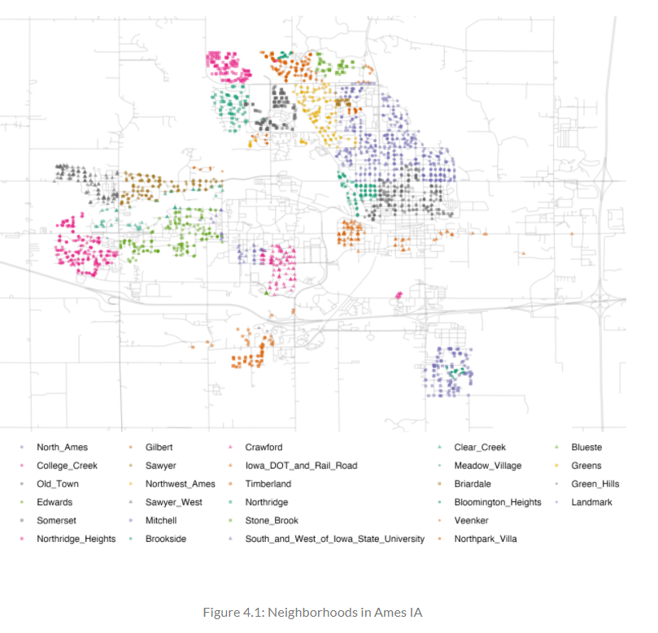
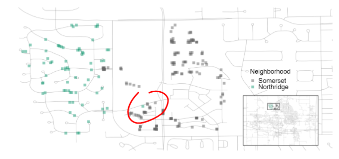
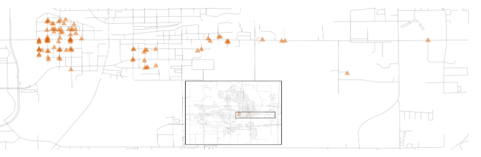

# Basics

## CHAPTER 4 The Ames Housing Data

1. The Ames housing data set (De Cock 2011) contains data on 2,930 properties in Ames, Iowa, including columns related to:

* house characteristics (bedrooms, garage, fireplace, pool, porch, etc.)
* location (neighborhood)
* lot information (zoning, shape, size, etc.)
* ratings of condition and quality
* sale price

```{r}

library(modeldata) # This is also loaded by the tidymodels package
data(ames)

# or, in one line:
data(ames, package = "modeldata")

dim(ames)
#> [1] 2930   74

```


### 4.1 Exploring Important Features

1. Start with the outcome we want to predict: the last sale price of the hourse (in USD):

*Visaulize Data*
```{r}
ggplot(ames, aes(x = Sale_Price)) + 
  geom_histogram(bins = 50)

```
a. The data are right-skewed: more inexpensive houses than expensive ones

b. Median sale price: $160,000

c. Most expensive: $755,000

d. Modeling:

(1) When modeling this outcome, the price should be log-transformed:

(a) To ensure no houses would be predicted with negative sale prices.

(b) A log transform may stabilize the variance in a way that makes inference more legitimate.


*Visualize Log-Transformed Data*
```{r}

ggplot(ames, aes(x = Sale_Price)) + 
  geom_histogram(bins = 50) +
  scale_x_log10()


# Change outcome column to log based
ames <- ames %>% mutate(Sale_Price = log10(Sale_Price))

```
(c) The downside to transforming the outcome is mostly related to interpretation: the units of the model coefficients might be more difficult to interpret, as will measures of performance. 

<1> Example: the root mean squared error (RMSE) is a common performance metric that is used in regression models. It uses the difference between the observed and predicted values in its calculations. If the sale price is on the log scale, these differences (i.e. the residuals) are also in log units. For this reason, it can be difficult to understand the quality of a model whose RSME is 0.15 log units. 


2. Another important aspect of these data for our modeling are their geographic locations. 

a. This spatial information is contained in the data in two ways:

(1) a qualitative: `Neighborhood` label 

(2) a quantitative: `longitude` and `latitude` data

*Visualize Ames Neighborhoods*



b. A few noticeable patterns:

(1) There is a void of data points in the center of Ames, this corresponds to Iowa State University.

(2) While there are a number of neighborhoods that are geographically isolated, there are other s that are adjacent to each other. 

(3) A detailed inspection of the map also shows that the neighborhood labels are not complete reliable.

(a) Example: there are some properties located as being in Northridge that are surrounded by houses in the adjacent Somerset neighborhood.



(4) The “Iowa Department of Transportation (DOT) and Rail Road” neighborhood adjacent to the main road on the east side of Ames. There are several clusters of houses within this neighborhood as well as some longitudinal (east-west) outliers; the two houses furthest east are isolated from the other locations.




3. Some basic questions that could be examined in EDA prior to beginning any modeling are:

a. Are there any odd or noticeable things about the distributions of the individual predictors? Is there much skewness or any pathological distributions?

b. Are there high correlations between predictors? For example, there are multiple predictors related to the size of the house. Are some redundant?

c. Are there associations between predictors and outcomes?

### 4.2 Chapter Summary

1. This chapter introduced a data set Ames. 

2. Exploratory Data Analysis (EDA) is an essential component of any modeling project; EDA uncovers information that contributes to better modeling practice. 
