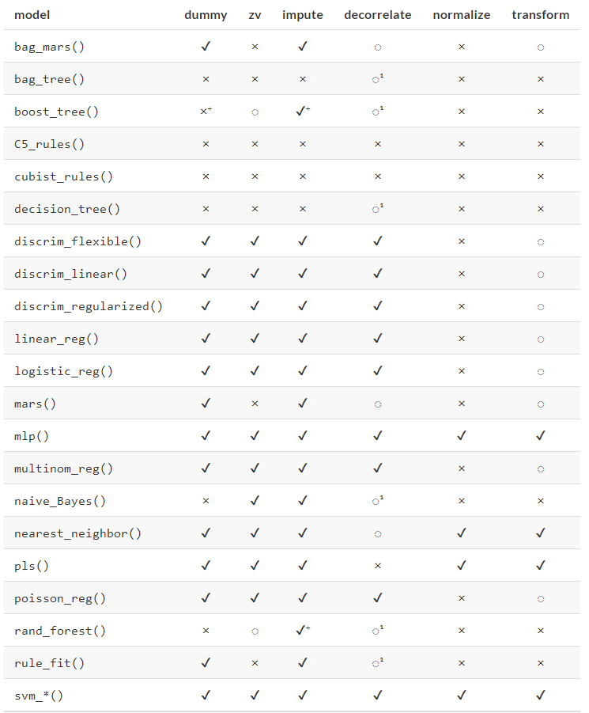
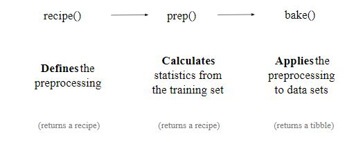
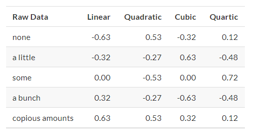
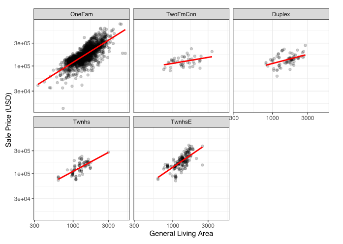
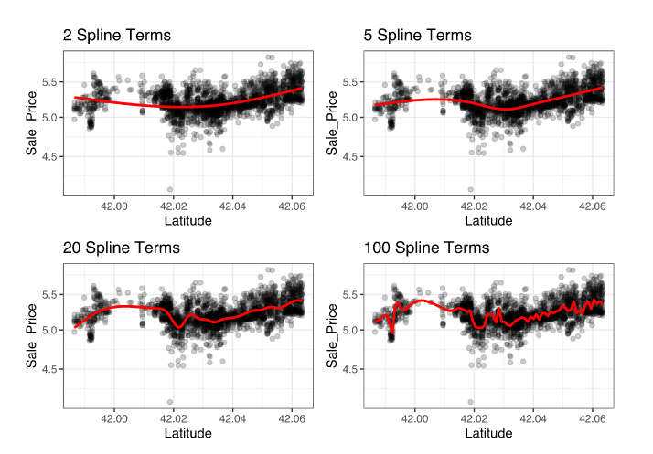

```{r}
library(tidyverse)
library(tidymodels)
```


# Basics
## CHAPTER 6 Feature Engineering with Recipes

*Goal of Feature Engineering:* develop a protocol or operation that we can maximize the information.

1. Feature engineering encompasses activities that reformat predictor values to make them easier for a model to use effectively. 

a. This includes transformations and encoding of the data to best represent their important characteristics. 

(1) Example: two predictors in a data set that can be more effectively represented in your model of interest as a ratio; creating a new predictor from the ratio of the original two is a simple example of feature engineering. 
(2) When choosing how to encode data in modeling, might choose an option that we believe most associated  with the outcome. 

(3) The original format of the data, for example numeric versus categorical is also a driving factor in feature engineering choices. 


2. Examples of Preprocessing to build better features for modeling:

a. Correlation between predictors can be reduced via feature extraction or the removal of some predictors. 

b. When some predictors have missing values, they can be imputed using a sub-model.

c. Models that use variance-type measures may benefit from coercing the distribution of some skewed predictors to be symmetric by estimating a transformation. 


3. Feature engineering and data preprocessing can also involve reformatting _required_ by the model. Some models use geometric distance metrics and, consequently, numeric predictors should be centered and scaled so that they are all in the same units. 

4. The type of preprocessing is dependent on the type of model being fit. 

a. The preprocessing methods are categorized as:

*dummy*: Do qualitative predictors require a numeric encoding (e.g. via dummy variables or other methods).

*zv*: Should columns with a single unique value be removed? 

*impute*: If some predictors are missing, should they be estimated via imputation?

*decorrelate*: If there are correlated predictors, should this correlation be mitigated? This might mean filtering out predictors, using principal component analysis, or a model-based technique (e.g. regularization).


*normalize*: Should predictors be centered and scaled?

*transform*: Is it helpful to transform predictors to be more symmetric?


b. Table of preprocessings recommended for different models:




_Notes_: 

1. Decorrelating predictors may not help improve performance. However, fewer correlated predictors can improve the estimation of variance importance scores. 

2. The notation of `+` means that the answer depends on the implementation. Specifically:

a. Theoretically, any tree-based model does not require imputation. However, many tree ensemble implementations require imputation. 

b. While tree-based boosting methods generally do not require the creation of dummt variables, models using the `xgboost` engine do. 


5. The `recipes` package can use to combine different feature engineering and preprocessing tasks into a single object and then apply these transformations to different data sets. 


### 6.1 A Simple Recipe for the AMES Housing Data

1. Focus on a small subset of the predictors available in the Ames housing data:

* The neighborhood (qualitative, with 29 neighborhoods in the training set)

* The general living area (continuous, named `Gr_Liv_Area`)

* The year built (`Year_Built`)

* The type of building (`Bldg_Type` with values `OneFam` (n = 1814), `TwoFam` (n = 45), `Duplex` (n = 76), `Twnhs` (n = 76), and `TwnhsE` (n = 188))


2. An initial ordinary linear regression model (with sale prices pre-logged)

```{r}
data(ames, package = "modeldata")

# Change outcome column to log based
ames <- ames %>% mutate(Sale_Price = log10(Sale_Price))

lm(Sale_Price ~ Neighborhood + log10(Gr_Liv_Area) + Year_Built + Bldg_Type, data = ames)


```

When the `lm()` function is executed, the data are converted from a data frame to a numeric `design matrix` (also called a `model matrix`) and then the least squares method is used to estimate parameters. 


a. Decompose `lm()`:

(1) Sale price is defined as the outcome while neighborhood, general livign area, the year built, and building type variables are all defined as predictos. 

(2) A log transformation is applied to the general living area predictor. 

(3) The neighborhood and building type columns are converted from a non-numeric format to a numeric format (since least squares requires numeric predictors).

3. A recipe is also an object that defines a series of steps for data processing. 

a. Unlike the formula method inside a modeling function, the recipe defines the steps without immediately executing them; it is only a specification of what should be done. 

b. A recipe equivalent to the formula above:

```{r eval = FALSE}

#library(tidymodels) # Includes the recipes package

simple_ames <- 
  recipe(Sale_Price ~ Neighborhood + Gr_Liv_Area + Year_Built + Bldg_Type,
         data = ames_train) %>%
  step_log(Gr_Liv_Area, base = 10) %>% 
  step_dummy(all_nominal())
simple_ames
#> Data Recipe
#> 
#> Inputs:
#> 
#>       role #variables
#>    outcome          1
#>  predictor          4
#> 
#> Operations:
#> 
#> Log transformation on Gr_Liv_Area
#> Dummy variables from all_nominal()

```

(1) Decompose `recipe()`:

(a) The call to `recipe()` with a formula tells the recipe the roles of the variables (e.g. predictor, outcome). It only uses the data to determine the data types for the columns. 

(b) `step_log()`: declares that `Gr_Liv_Area` should be log transformed.

(c) `step_dummy()`: used to specify which variables should be converted from a qualitative format to a quantitative format, in this case, using dummy or indicator variables. 

<1> An indicator or dummy variables is a binary numeric variable (a column of 1s and 0s) that encode qualitative information.

<2> The function `all_nominal()` captures the names of any columns that are currently factor or character (i.e. nominal) in nature. This is a `dplyr` selector function but can only be used inside a recipe. 

<3> Other selectors specific to the `recipes` package are:

`all_numeric()`, `all_predictors()`, `all_outcomes`. 

<3> As with `dplyr`, one or more unquoted expressions, separated by commas, can be used to select which columns are affected by each step. 

c. Advantages of using a recipe:

(1) These computations can be recycled across models since they are not tightly coupled to the modeling function. 

(2) A recipe enables a broader set of data processing choices than fomrulas can offer. 

(3) The syntax can be very compact. For example, `all_nominal()` can be used to capture many variables for specific types of processing while a formula would require each to be explicitly listed. 

(4) All data processing can be captured in a single R object instead of in scripts that are repeated, or even spread across different files. 


### 6.2 Using Recipes

1. First Phase for Using a Recipe: when invoking the `recipe()` function, the steps are not estimated or executed in any way. 

2. Second Phase for Using a Recipe: to estimate any quantities required by the steps using the `prep()` function. 

a. Example: use 

* `step_normalize()` to center and scale any predictors selected in the step; 

* `prep(recipe, training)` estimates the required means and standard deviations from the data in the `training` argument. 

b. The transformations specified by each step are also sequentially executed on the data set. 

(1) When specifying a step, the data available to that step have been affected by the previous operations. 

c. `prep()`:

```{r eval = FALSE}
simple_ames <- prep(simple_ames, training = ames_train)
simple_ames
#> Data Recipe
#> 
#> Inputs:
#> 
#>       role #variables
#>    outcome          1
#>  predictor          4
#> 
#> Training data contained 2199 data points and no missing data.
#> 
#> Operations:
#> 
#> Log transformation on Gr_Liv_Area [trained]
#> Dummy variables from Neighborhood, Bldg_Type [trained]
```

Note that, after preparing the recipe, the print statement shows the results of the selectors (e.g., Neighborhood and Bldg_Type are listed instead of all_nominal).

(1) One important argument to `prep()` is `retain`: when `TRUE` (default), the prepared version of the training set is kept within the recipe.

(a) Since `prep()` has to execute the recipe as it proceeds, it may be advantageous to keep this version of the training set so that, if that data set is to be used later, redundant calculations can be avoided.

(b) However, if the training set is big, it may be problematic to keep such a large amount of data in memory. Use `retain = FALSE` to avoid this.

3. Third Phase for Using a Recipe: apply the preprocessing operations to a data set using the `bake()` function. 

a. The `bake()` function can apply the recipe to _any_ data set. 

b. Use `bake()` on the test set:

```{r eval = FALSE}

test_ex <- bake(simple_ames, new_data = ames_test)
names(test_ex) %>% head()
#> [1] "Gr_Liv_Area"                "Year_Built"                
#> [3] "Sale_Price"                 "Neighborhood_College_Creek"
#> [5] "Neighborhood_Old_Town"      "Neighborhood_Edwards"

# Note the dummy variable columns starting with Neighborhood_

```

(1) The `bake()` function can also take selectors so that, if we only wanted the neighborhood results, we could use:

```{r eval = FALSE}

bake(simple_ames, ames_test, starts_with("Neighborhood_"))

```

c. Process the training set: use `bake()` and pass in the argument `ames_train`. But as previously mentioned, this would repeat calculations that have already been executed. Instead, we can use `new_data = NULL` to quickly return the training set (if `retain = TRUE` was used). It accesses the data component of the prepared recipe:

```{r eval = FALSE}

bake(simple_ames, new_data = NULL) %>% nrow()
#> [1] 2199
ames_train %>% nrow()
#> [1] 2199

```

4. Summary: Three Phases of Using a Recipe:



5. There are high level functions that handlge the second two phases automatically. In these cases, we do not have to manually use `prep()` and `bake()` to include a recipe in the modeling process. 


### 6.3 Encoding Qualitative Data in a Numeric Format

1. One of the most common feature engineering tasks is transforming nominal or qualitative data (factors or characters) so that they can be encoded or represented numerically. 

a. Sometimes we can alter the factor levels of a qualitative column in helpful ways _prior_ to such a transformation. 

(1) Example: 

* `step_unknown()` can be used to change missing values to a dedicated factor level. 

* `step_novel()` can allot a new level if we anticipate that a new factor level may be encountered in future data. 

* `step_other()` can be used to analyze the frequencies of the factor leves in the training set and convert infrequently occuring values to a catch-al level of "other", with a specific threshold that can be specified. 

```{r eval = FALSE}

ggplot(ames_train, aes(y = Neighborhood)) + 
  geom_bar() + 
  labs(y = NULL)

```

If we add `step_other(Neighborhood, threshold = 0.01)` to our recipe, the bottom 1% of the neighborhoods will be lumped into a new level called “other”. In this training set, this will catch 9 neighborhoods:

```{r eval = FALSE}

simple_ames <- 
  recipe(Sale_Price ~ Neighborhood + Gr_Liv_Area + Year_Built + Bldg_Type,
         data = ames_train) %>%
  step_log(Gr_Liv_Area, base = 10) %>% 
  step_other(Neighborhood, threshold = 0.01) %>% 
  step_dummy(all_nominal())

```


2. Many, but not all, underlying model calculations require predictor values to be encoded as numbers. Notable exceptions include _tree-based models_, _rule-based models_, and _naive Bayes models_.


3. There are a few strategies for converting a factor predictor to a numeric format.

a. The most common method is to create “dummy” or indicator variables. 

b. Example: For dummy variables, the single `Bldg_Type` column would be replaced with four numeric columns whose values are either zero or one. These binary variables represent specific factor level values. In R, the convention is to exclude a column for the first factor level (OneFam, in this case). The `Bldg_Type` column would be replaced with a column called `TwoFmCon` that is one when the row has that value and zero otherwise. Three other columns are similarly created:


c. The full set of encodings can be used for some models. This is traditionally called the “one-hot” encoding and can be achieved using the `one_hot` argument of `step_dummy()`.

d. One helpful feature of `step_dummy()` is that there is more control over how the resulting dummy variables are named.

(1) In base R, dummy variable names mash the variable name with the level, resulting in names like NeighborhoodVeenker. 

(2) Recipes, by default, use an underscore as the separator between the name and level (e.g., Neighborhood_Veenker) and there is an option to use custom formatting for the names. The default naming convention in recipes makes it easier to capture those new columns in future steps using a selector, such as starts_with("Neighborhood_").


4. Feature Hashing Methods:

a. Traditional dummy variables require that all of the possible actegories be known to create a full set of numeric features. There are other methods for doing this transformation to a numeric format. 

b. Feature hashing methods only consider the value of the category to assign it to a predefined pool of dummy variables. 

(1) This can be a good strategy when there are a large number of possible categories, but the statistical properties may not be optimal. 

(a) Example: it may unnecessarily alia categories together (by assigning them to the same dummy variable). This reduces the speificity of the encoding and, if that dummy variable were important, it would be difficult to determine which of the categories is driving the effect. 

5. Effect/Likelihood Encodings:

a. Effect/Likehood Encoding replaces the original data with a single numeric column that measures the effect of those data. 

(1) Example: for the neighborhood predictor, the mean sale price is computed for each neighborhood and these means are substituted for the original data values. 

(2) This should be used with care. In effect, a mini model is being added to the actual model and this can lead to over fitting. 

(3) To be cautious, this type of encoding should be rigorously resampled. 

b. Within a recipe, the `embed` package has several step functions, such as `step_lencode_mixed()`, for effect encodings. 

Note: BOTH feature hashing and effect encoding methods can also seamlessly handle situations where a novel factor level is countered in the data. 

6. Order Qualitative Columns: 

a. Sometimes qualitative columns can be ordered, such as “low”, “medium”, “high”. In base R, the default encoding strategy is to make new numeric columns that are polynomial expansions of the data. For columns that have five ordinal values, the factor column would be replaced with columns for linear, quadratic, cubic, and quaratic terms:



b. While this is not unreasonable, it is not an approach that people tend to find useful. 

(1) Example: a 11-degree polynomial is probably not the most effective way of encoding an ordinal factor for months. 

c. Instead, consider trying recipe steps related to ordered factors, such as `step_unorder()`, to convert to regular factors, and `step_ordinalscore()` which maps specific numeric values to each factor level.

7. Different recipe steps can have different effects on columns of the data. 

a. Example: 

(1) `step_log()` modifies a column in-place without changing the name. 
(2) `step_dummy()` eliminate the original data column and replace it with one or more columns with different names. This behavior depends on the type of operation being done.


### 6.4 Interaction Terms

1. Interaction effects involve two or more predictors. Such an effect occurs when one predictor has an effect on the outcome that is contingent on one or more other predictors. 

a. Example: if you were trying to predict your morning commute time, two potential predictors could be the amount of traffic and the time of day. However, the relationship between commute time and the amount of traffic is different for different times of day. In this case, you could add an interaction term between the two predictors to the model along with the original two predictors (which are called the “main effects”).

2. Numerically, an interaction term between predictors is encoded as their product. Interactions are only defined in terms of their effect on the outcome and can be combinations of different types of data (e.g., numeric, categorical, etc). 

3. Example: after exploring the Ames training set, we might find that the regression slopes for the general living area differ for different building types:

```{r eval = FALSE}

ggplot(ames_train, aes(x = Gr_Liv_Area, y = 10^Sale_Price)) + 
  geom_point(alpha = .2) + 
  facet_wrap(~ Bldg_Type) + 
  geom_smooth(method = lm, formula = y ~ x, se = FALSE, col = "red") + 
  scale_x_log10() + 
  scale_y_log10() + 
  labs(x = "General Living Area", y = "Sale Price (USD)")

```




How are interactions specified in a recipe? A base R formula would take an interaction using a :, so we would use:

```{r eval = FALSE}

Sale_Price ~ Neighborhood + log10(Gr_Liv_Area) + Bldg_Type + log10(Gr_Liv_Area):Bldg_Type
# or
Sale_Price ~ Neighborhood + log10(Gr_Liv_Area) * Bldg_Type 

```

where `*` expands those columns to the main effects and interaction term.


4. Recipes are more explicit and sequential, and give you more control. With the current recipe, `step_dummy()` has already created dummy variables. The additional step would look like `step_interact(~ interaction terms)` where the terms on the right-hand side of the tilde are the interactions. These can include selectors, so it would be appropriate to use:

```{r eval = FALSE}


simple_ames <- 
  recipe(Sale_Price ~ Neighborhood + Gr_Liv_Area + Year_Built + Bldg_Type,
         data = ames_train) %>%
  step_log(Gr_Liv_Area, base = 10) %>% 
  step_other(Neighborhood, threshold = 0.01) %>% 
  step_dummy(all_nominal()) %>% 
  # Gr_Liv_Area is on the log scale from a previous step
  step_interact( ~ Gr_Liv_Area:starts_with("Bldg_Type_") )

```

a. Additional interactions can be specified in this formula by separating them by `+`. Also note that the recipe will only utilize interactions between different variables; if the formula uses `var_1:var_1`, this term will be ignored.

b. Suppose that, in a recipe, we had not yet made dummy variables for building types. It would be inappropriate to include a factor column in this step, such as:

```{r eval = FALSE}
step_interact( ~ Gr_Liv_Area:Bldg_Type )

```

This is telling the underlying (base R) code used by step_interact() to make dummy variables and then form the interactions. In fact, if this occurs, a warning states that this might generate unexpected results.


c. As with naming dummy variables, recipes provides more coherent names for interaction terms. In this case, the interaction is named `Gr_Liv_Area_x_Bldg_Type_Duplex` instead of `Gr_Liv_Area:Bldg_TypeDuplex` (which is not a valid column name for a data frame).


### 6.5 Skipping Steps for New Data

1. Simple transformations of the outcome column(s), such as taking logs shuold be conducted outside of the recipe.

a. Example: the sale price data are already log transformed in the ames data frame. Why not use:`step_log(Sale_Price, base = 10)`?

This will cause a failure when the recipe is applied to new properties when the sale price is not known. Since price is what we are trying to predict, there probably won’t be a column in the data for this variable. In fact, to avoid information leakage, many tidymodels packages isolate the data being used when making any predictions. This means that the training set and any outcome columns are not available for use at prediction time.


2. There are other circumstances where this is not an adequate solution.

a. Example: in classification models where there is a severe class imbalance, it is common to conduct subsampling of the data that are given to the modeling function. 

Suppose that there were two classes and a $10\%$ event rate. A simple, albeit controversial, approach would be to down-sample the data so that the model is provided with all of the events and a random 10% of the non-event samples.

The problem is that the same subsampling process should not be applied to the data being predicted. As a result, when using a recipe, we need a mechanism to ensure that some operations are only applied to the data that are given to the model. Each step function has an option called `skip` that, when set to `TRUE`, will be ignored by the `bake()` function used with a data set argument. In this way, you can isolate the steps that affect the modeling data without causing errors when applied to new samples. However, all steps are applied when using `bake(new_data = NULL)`.

b. Step functions in the `recipes` and `themis` packages that are only applied to the modeling data are: 

`step_adasyn()`, 

`step_bsmote()`, 

`step_downsample()`, 

`step_filter()`, 

`step_nearmiss()`, 

`step_rose()`, 

`step_sample()`, 

`step_slice()`, 

`step_smote()`, 

`step_tomek()`, 

`step_upsample()`


### 6.6. Other Examples of Recipe Steps

1. *Spline Functions*

a. When a predictor has a _nonlinear_ relationship with the outcome, some types of predictive models can adaptively approximate this relationship during training. However, 

(1). One common method is to use spline functions to represent the data. Splines replace the existing numeric predictor with a set of columns that allow a model to emulate a flexible, non-linear relationship. As more spline terms are added to the data, the capacity to non-linearly represent the relationship increases. 

(a) Unfortunately, it may also increase the likelihood of picking up on data trends that occur by chance (i.e., over-fitting).

(b) `geom_smooth()` within a ggplot is a spline representation of the data. 

(c) Example: each panel below uses a different number of smooth splines for the latitude predictor:

```{r eval = FALSE}

library(patchwork)
library(splines)

plot_smoother <- function(deg_free) {
  ggplot(ames_train, aes(x = Latitude, y = Sale_Price)) + 
    geom_point(alpha = .2) + 
    scale_y_log10() +
    geom_smooth(
      method = lm,
      formula = y ~ ns(x, df = deg_free),
      col = "red",
      se = FALSE
    ) +
    ggtitle(paste(deg_free, "Spline Terms"))
}

( plot_smoother(2) + plot_smoother(5) ) / ( plot_smoother(20) + plot_smoother(100) )

```





The `ns()` function in the `splines` package generates feature columns using functions called _natural splines_.

<1> Some panels clearly fit poorly; two terms under-fit the data while 100 terms over-fit. 

<2> The panels with five and 20 terms seem like reasonably smooth fits that catch the main patterns of the data. This indicates that the proper amount of “non-linear-ness” matters. 

<3> The number of spline terms could then be considered a tuning parameter for this model. 

b. In `recipes`, there are multiple steps that can create these types of terms. To add a natural spline representation for this predictor:

```{r eval = FALSE}

recipe(Sale_Price ~ Neighborhood + Gr_Liv_Area + Year_Built + Bldg_Type + Latitude,
         data = ames_train) %>%
  step_log(Gr_Liv_Area, base = 10) %>% 
  step_other(Neighborhood, threshold = 0.01) %>% 
  step_dummy(all_nominal()) %>% 
  step_interact( ~ Gr_Liv_Area:starts_with("Bldg_Type_") ) %>% 
  step_ns(Latitude, deg_free = 20)
```


2. *Feature Extraction*

a. Another common method for representing multiple features at once is called feature extraction. 

(1) Most of these techniques create new features from the predictors that capture the information in the broader set as a whole. 

(a) Example: principal component analysis (PCA) tries to extract as much of the original information in the predictor set as possible using a smaller number of features. 

<1> PCA is a linear extraction method, meaning that each new feature is a linear combination of the original predictors. 

<2> One nice aspect of PCA is that each of the new features, called the principal components or PCA scores, are uncorrelated with one another. 

Because of this, PCA can be very effective at reducing the correlation between predictors. 

<3> Note that PCA is only aware of the predictors; the new PCA features might not be associated with the outcome.

<4> Example: in the Ames data, there are several predictors that measure size of the property, such as the total basement size (`Total_Bsmt_SF`), size of the first floor (`First_Flr_SF`), the general living area (`Gr_Liv_Area`), and so on. PCA might be an option to represent these potentially redundant variables as a smaller feature set. Apart from the general living area, these predictors have the suffix SF in their names (for square feet) so a recipe step for PCA might look like:

```{r eval = FALSE}

# Use a regular expression to capture house size predictors: 
step_pca(matches("(SF$)|(Gr_Liv)"))

```


<5> PCA assumes that all of the predictors are on the same scale. This step is often preceded by `step_normalize()`, which will center and scale each column.

(b) There are existing recipe steps for other extraction methods, such as:

independent component analysis (ICA), 

non-negative matrix factorization (NNMF), 

multidimensional scaling (MDS), 

uniform manifold approximation,

projection (UMAP)


3. *Row Sampling Steps*

a. Recipe steps can affect the rows of a data set as well. 

(1) Example: subsampling technique for class imbalances will change the data being given to the model. There are several possible approaches to try:

(a) Down-sampling the data keeps the minority class and takes a random sample of the majority class so that class frequencies are balanced.

(b) Upsampling replicates samples from the minority class to balance the classes. Some techniques do this by synthesizing new samples that resemble the minority class data while other methods simply add the same minority samples repeatedly.

(c) Hybrid methods do a combination of both.

The `themis` package has recipe steps the can be used for this purpose. For simple down-sampling, we would use:

```{r eval = FALSE}

step_downsample(outcome_column_name)

```


Note: Only the training set should be affected by these techniques. The test set or other holdout samples should be left as-is when processed using the recipe. For this reason, all of the subsampling steps default the skip argument to have a value of TRUE (Section 6.5).

(2) There are other step functions that are row-based as well: `step_filter()`, 

`step_sample()`, 

`step_slice()`,

`step_arrange()`

(a) In almost all uses of these steps, the skip argument should be set to `TRUE`.


4. *General Transformations*

a. Mirroring the original `dplyr` operations, `step_mutate()` and `step_mutate_at()` can be used to conduct a variety of basic operations to the data.


5. *Natural Language Processing*

a. Recipes can also handle data that are not in the traditional structure where the columns are features. 

(1) Example: the `textrecipes` package can apply natural language processing methods to the data. The input column is typically a string of text and different steps can be used to tokenize the data (e.g., split the text into separate words), filter out tokens, and create new features appropriate for modeling.


### 6.7 How Data Are Used By The Recipe

1. Data are given to recipes at different stages. 

a. When calling `recipe(..., data)`, the data set is used to determine the data types of each column so that selectors such as `all_numeric()` can be used. 

b. When preparing the data using `prep(recipe, training)`, the data in training are used for all estimation operations, from determining factor levels to computing PCA components and everything in between. 

(1) It is important to realize that all preprocessing and feature engineering steps only utilize the training data. Otherwise, information leakage can negatively impact the model.

c. When using `bake(recipe, new_data)`, no quantities are re-estimated using the values in new_data. 

(1) Take centering and scaling using `step_normalize()`.

(a) Example: using this step, the means and standard deviations from the appropriate columns are determined from the training set; new samples are standardized using these values when `bake()` is invoked.


### 6.8 Using a Recipe with Traditional Modeling Functions

1. High-level interfaces that take a recipe as an input argument and automatically handle the `prep()`/`bake()` process of preparing data for modeling. However, recipes can be used with traditional R modeling functions as well.

a. Example: a slightly augmented version of the last recipe, now including longitude.

```{r eval = FALSE}

ames_rec <- 
  recipe(Sale_Price ~ Neighborhood + Gr_Liv_Area + Year_Built + Bldg_Type + 
           Latitude + Longitude, data = ames_train) %>%
  step_log(Gr_Liv_Area, base = 10) %>% 
  step_other(Neighborhood, threshold = 0.01) %>% 
  step_dummy(all_nominal()) %>% 
  step_interact( ~ Gr_Liv_Area:starts_with("Bldg_Type_") ) %>% 
  step_ns(Latitude, Longitude, deg_free = 20)

```


* To get the recipe ready, we prepare it, and then extract the training set using `bake()` with `new_data = NULL`. When calling `prep()`, if the training argument is not given, it uses the data that was initially given to the `recipe()` function call.

```{r eval = FALSE}

ames_rec_prepped <- prep(ames_rec)
ames_train_prepped <- bake(ames_rec_prepped, new_data = NULL)
ames_test_prepped <- bake(ames_rec_prepped, ames_test)

# Fit the model; Note that the column Sale_Price has already been
# log transformed.
lm_fit <- lm(Sale_Price ~ ., data = ames_train_prepped)

```


* The `broom` package has methods that make it easier to work with model objects. First, `broom::glance()` shows a succinct summary of the model in a handy tibble format:

```{r eval = FALSE}

glance(lm_fit)
#> # A tibble: 1 x 12
#>   r.squared adj.r.squared  sigma statistic p.value    df logLik    AIC    BIC
#>       <dbl>         <dbl>  <dbl>     <dbl>   <dbl> <dbl>  <dbl>  <dbl>  <dbl>
#> 1     0.822         0.816 0.0757      140.       0    70  2592. -5040. -4630.
#> # … with 3 more variables: deviance <dbl>, df.residual <int>, nobs <int>

```


* The model coefficients can be extracted using the `tidy()` method:

```{r eval = FALSE}
tidy(lm_fit)
#> # A tibble: 71 x 5
#>   term                       estimate std.error statistic   p.value
#>   <chr>                         <dbl>     <dbl>     <dbl>     <dbl>
#> 1 (Intercept)                -0.531    0.296        -1.79 7.32e-  2
#> 2 Gr_Liv_Area                 0.648    0.0161       40.3  1.46e-264
#> 3 Year_Built                  0.00194  0.000139     13.9  2.69e- 42
#> 4 Neighborhood_College_Creek -0.0898   0.0332       -2.71 6.83e-  3
#> 5 Neighborhood_Old_Town      -0.0516   0.0129       -4.01 6.20e-  5
#> 6 Neighborhood_Edwards       -0.153    0.0274       -5.57 2.91e-  8
#> # … with 65 more rows
```

* To make predictions on the test set, we use the standard syntax:

```{r eval = FALSE}

predict(lm_fit, ames_test_prepped %>% head())
#>     1     2     3     4     5     6 
#> 5.308 5.301 5.168 5.519 5.088 5.489

```


### 6.9 Tidy A Recipe

1. In Section 3.3, we introduced the `tidy()` verb for statistical objects; 

In Section 6.8, we showed how to `tidy() a model.

In section 6.9, we will show `tidy()` method for recipes: calling it with no other arguments gives a summary of the recipe steps.

```{r eval = FALSE}

tidy(ames_rec_prepped)
#> # A tibble: 5 x 6
#>   number operation type     trained skip  id            
#>    <int> <chr>     <chr>    <lgl>   <lgl> <chr>         
#> 1      1 step      log      TRUE    FALSE log_Zpjfz     
#> 2      2 step      other    TRUE    FALSE other_qHT9d   
#> 3      3 step      dummy    TRUE    FALSE dummy_3SK4C   
#> 4      4 step      interact TRUE    FALSE interact_gyWyl
#> 5      5 step      ns       TRUE    FALSE ns_qG7ic

```

We can specify the id field in a step function call but otherwise it is generated using a random suffix. This field can be helpful if the same type of step is added to the recipe more than once. Let’s specify the id ahead of time for `step_log()`, since we want to `tidy()` it:

```{r eval = FALSE}

ames_rec <- 
  recipe(Sale_Price ~ Neighborhood + Gr_Liv_Area + Year_Built + Bldg_Type + 
           Latitude + Longitude, data = ames_train) %>%
  step_log(Gr_Liv_Area, base = 10, id = "my_id") %>% 
  step_other(Neighborhood, threshold = 0.01) %>% 
  step_dummy(all_nominal()) %>% 
  step_interact( ~ Gr_Liv_Area:starts_with("Bldg_Type_") ) %>% 
  step_ns(Latitude, Longitude, deg_free = 20)

ames_rec_prepped <- prep(ames_rec)

```


* The `tidy()` method can be called again along with the id identifier we specified to get these results:

```{r eval = FALSE}

tidy(ames_rec_prepped, id = "my_id")
#> # A tibble: 1 x 3
#>   terms        base id   
#>   <chr>       <dbl> <chr>
#> 1 Gr_Liv_Area    10 my_id

```


* The `tidy()` method can be called with the number identifier as well, if we know which step in the recipe we need:

```{r eval = FALSE}

tidy(ames_rec_prepped, number = 2)
#> # A tibble: 20 x 3
#>   terms        retained           id         
#>   <chr>        <chr>              <chr>      
#> 1 Neighborhood North_Ames         other_6Nta6
#> 2 Neighborhood College_Creek      other_6Nta6
#> 3 Neighborhood Old_Town           other_6Nta6
#> 4 Neighborhood Edwards            other_6Nta6
#> 5 Neighborhood Somerset           other_6Nta6
#> 6 Neighborhood Northridge_Heights other_6Nta6
#> # … with 14 more rows

```


* Each `tidy()` method returns the relevant information about that step. For example, the `tidy()` method for `step_dummy()` returns a column with the variables that were converted to dummy variables and another column with all of the known levels for each column.


### 6.10 Column Roles

1. When a formula is used with the initial call to `recipe()` it assigns roles to each of the columns depending on which side of the tilde that they are on. Those roles are either "predictor" or "outcome". However, other roles can be assigned as needed.

a. Example: in our Ames data set, the original raw data contained a field for address. It may be useful to keep that column in the data so that, after predictions are made, problematic results can be investigated in detail. In other words, the column is important but isn’t a predictor or outcome.

b. To solve this, the `add_role()`, `remove_role()`, and `update_role()` functions can be helpful. 

(1) Example: for the house price data, the street address column could be modified using

```{r eval = FALSE}

ames_rec %>% update_role(address, new_role = "street address")

```


2. Any character string can be used as a role. 

3. columns can have multiple roles so that they can be selected under more than one context.

4. This can be helpful when the data are _resampled_. It helps to keep the columns that are not involved with the model fit in the same data frame (rather than in an external vector). 

a. Resampling creates alternate versions of the data mostly by row subsampling. If the street address were in another column, additional subsampling would be required and might lead to more complex code and a higher likelihood of errors.

5. All step functions have a role field that can assign roles to the results of the step. 

a. In many cases, columns affected by a step retain their existing role.

(1) Example: the `step_log()` calls to the `ames_rec` object above affected the `Gr_Liv_Area` column. For that step, the default behavior is to keep the existing role for this column since no new column is created. 

(2) Counter-example, the step to produce splines defaults new columns to have a role of "predictor" since that is usually how spline columns are used in a model. 


### 6.11 Chapter Summary


1. Using recipes for flexible feature engineering and data pre-processing, from creating dummy variables to handling class imbalance and more.

2. Feature engineering is an important part of the modeling process where information leakage can easily occur and good practices must be adopted. 

3. Between the `recipes` package and other packages that extend recipes, there are over 100 available steps. 

a. All possible recipe steps are enumerated at tidymodels.org/find. 

b. The recipes framework provides a rich data manipulation environment for preprocessing and transforming data prior to modeling. 

c. Additionally, tidymodels.org/learn/develop/recipes/ shows how custom steps can be created.
