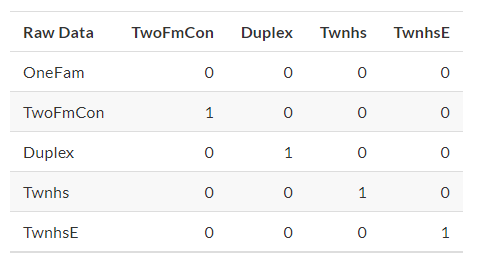

```{r}
library(tidyverse)
library(tidymodels)
```


# Basics
## CHAPTER 6 Feature Engineering with Recipes

1. Feature engineering encompasses activities that reformat predictor values to make them easier for a model to use effectively. 

a. This includes transformations and encoding of the data to best represent their important characteristics. 

(1) Example: two predictors in a data set that can be more effectively represented in your model of interest as a ratio; creating a new predictor from the ratio of the original two is a simple example of feature engineering. 
(2) When choosing how to encode data in modeling, might choose an option that we believe most associated  with the outcome. 

(3) The original format of the data, for example numeric versus categorical is also a driving factor in feature engineering choices. 


2. Examples of Preprocessing to build better features for modeling:

a. Correlation between predictors can be reduced via feature extraction or the removal of some predictors. 

b. When some predictors have missing values, they can be imputed using a sub-model.

c. Models that use variance-type measures may benefit from coercing the distribution of some skewed predictors to be symmetric by estimating a transformation. 


3. Feature engineering and data preprocessing can also involve reformatting _required_ by the model. Some models use geometric distance metrics and, consequently, numeric predictors should be centered and scaled so that they are all in the same units. 

4. The type of preprocessing is dependent on the type of model being fit. 

a. The preprocessing methods are categorized as:

*dummy*: Do qualitative predictors require a numeric encoding (e.g. via dummy variables or other methods).

*zv*: Should columns with a single unique value be removed? 

*impute*: If some predictors are missing, should they be estimated via imputation?

*decorrelate*: If there are correlated predictors, should this correlation be mitigated? This might mean filtering out predictors, using principal component analysis, or a model-based technique (e.g. regularization).


*normalize*: Should predictors be centered and scaled?

*transform*: Is it helpful to transform predictors to be more symmetric?


b. Table of preprocessings recommended for different models:


_Notes_: 

1. Decorrelating predictors may not help improve performance. However, fewer correlated predictors can improve the estimation of variance importance scores. 

2. The notation of `+` means that the answer depends on the implementation. Specifically:

a. Theoretically, any tree-based model does not require imputation. However, many tree ensemble implementations require imputation. 

b. While tree-based boosting methods generally do not require the creation of dummt variables, models using the `xgboost` engine do. 


5. The `recipes` package can use to combine different feature engineering and preprocessing tasks into a single object and then apply these transformations to different data sets. 


### 6.1 A Simple Recipe for the AMES Housing Data

1. Focus on a small subset of the predictors available in the Ames housing data:

* The neighborhood (qualitative, with 29 neighborhoods in the training set)

* The general living area (continuous, named `Gr_Liv_Area`)

* The year built (`Year_Built`)

* The type of building (`Bldg_Type` with values `OneFam` (n = 1814), `TwoFam` (n = 45), `Duplex` (n = 76), `Twnhs` (n = 76), and `TwnhsE` (n = 188))


2. An initial ordinary linear regression model (with sale prices pre-logged)

```{r}
data(ames, package = "modeldata")

# Change outcome column to log based
ames <- ames %>% mutate(Sale_Price = log10(Sale_Price))

lm(Sale_Price ~ Neighborhood + log10(Gr_Liv_Area) + Year_Built + Bldg_Type, data = ames)


```

When the `lm()` function is executed, the data are converted from a data frame to a numeric `design matrix` (also called a `model matrix`) and then the least squares method is used to estimate parameters. 


a. Decompose `lm()`:

(1) Sale price is defined as the outcome while neighborhood, general livign area, the year built, and building type variables are all defined as predictos. 

(2) A log transformation is applied to the general living area predictor. 

(3) The neighborhood and building type columns are converted from a non-numeric format to a numeric format (since least squares requires numeric predictors).

3. A recipe is also an object that defines a series of steps for data processing. 

a. Unlike the formula method inside a modeling function, the recipe defines the steps without immediately executing them; it is only a specification of what should be done. 

b. A recipe equivalent to the formula above:

```{r eval = FALSE}

#library(tidymodels) # Includes the recipes package

simple_ames <- 
  recipe(Sale_Price ~ Neighborhood + Gr_Liv_Area + Year_Built + Bldg_Type,
         data = ames_train) %>%
  step_log(Gr_Liv_Area, base = 10) %>% 
  step_dummy(all_nominal())
simple_ames
#> Data Recipe
#> 
#> Inputs:
#> 
#>       role #variables
#>    outcome          1
#>  predictor          4
#> 
#> Operations:
#> 
#> Log transformation on Gr_Liv_Area
#> Dummy variables from all_nominal()

```

(1) Decompose `recipe()`:

(a) The call to `recipe()` with a formula tells the recipe the roles of the variables (e.g. predictor, outcome). It only uses the data to determine the data types for the columns. 

(b) `step_log()`: declares that `Gr_Liv_Area` should be log transformed.

(c) `step_dummy()`: used to specify which variables should be converted from a qualitative format to a quantitative format, in this case, using dummy or indicator variables. 

<1> An indicator or dummy variables is a binary numeric variable (a column of 1s and 0s) that encode qualitative information.

<2> The function `all_nominal()` captures the names of any columns that are currently factor or character (i.e. nominal) in nature. This is a `dplyr` selector function but can only be used inside a recipe. 

<3> Other selectors specific to the `recipes` package are:

`all_numeric()`, `all_predictors()`, `all_outcomes`. 

<3> As with `dplyr`, one or more unquoted expressions, separated by commas, can be used to select which columns are affected by each step. 

c. Advantages of using a recipe:

(1) These computations can be recycled across models since they are not tightly coupled to the modeling function. 

(2) A recipe enables a broader set of data processing choices than fomrulas can offer. 

(3) The syntax can be very compact. For example, `all_nominal()` can be used to capture many variables for specific types of processing while a formula would require each to be explicitly listed. 

(4) All data processing can be captured in a single R object instead of in scripts that are repeated, or even spread across different files. 


### 6.2 Using Recipes

1. First Phase for Using a Recipe: when invoking the `recipe()` function, the steps are not estimated or executed in any way. 

2. Second Phase for Using a Recipe: to estimate any quantities required by the steps using the `prep()` function. 

a. Example: use 

* `step_normalize()` to center and scale any predictors selected in the step; 

* `prep(recipe, training)` estimates the required means and standard deviations from the data in the `training` argument. 

b. The transformations specified by each step are also sequentially executed on the data set. 

(1) When specifying a step, the data available to that step have been affected by the previous operations. 

c. `prep()`:

```{r eval = FALSE}
simple_ames <- prep(simple_ames, training = ames_train)
simple_ames
#> Data Recipe
#> 
#> Inputs:
#> 
#>       role #variables
#>    outcome          1
#>  predictor          4
#> 
#> Training data contained 2199 data points and no missing data.
#> 
#> Operations:
#> 
#> Log transformation on Gr_Liv_Area [trained]
#> Dummy variables from Neighborhood, Bldg_Type [trained]
```

Note that, after preparing the recipe, the print statement shows the results of the selectors (e.g., Neighborhood and Bldg_Type are listed instead of all_nominal).

(1) One important argument to `prep()` is `retain`: when `TRUE` (default), the prepared version of the training set is kept within the recipe.

(a) Since `prep()` has to execute the recipe as it proceeds, it may be advantageous to keep this version of the training set so that, if that data set is to be used later, redundant calculations can be avoided.

(b) However, if the training set is big, it may be problematic to keep such a large amount of data in memory. Use `retain = FALSE` to avoid this.

3. Third Phase for Using a Recipe: apply the preprocessing operations to a data set using the `bake()` function. 

a. The `bake()` function can apply the recipe to _any_ data set. 

b. Use `bake()` on the test set:

```{r eval = FALSE}

test_ex <- bake(simple_ames, new_data = ames_test)
names(test_ex) %>% head()
#> [1] "Gr_Liv_Area"                "Year_Built"                
#> [3] "Sale_Price"                 "Neighborhood_College_Creek"
#> [5] "Neighborhood_Old_Town"      "Neighborhood_Edwards"

# Note the dummy variable columns starting with Neighborhood_

```

(1) The `bake()` function can also take selectors so that, if we only wanted the neighborhood results, we could use:

```{r eval = FALSE}

bake(simple_ames, ames_test, starts_with("Neighborhood_"))

```

c. Process the training set: use `bake()` and pass in the argument `ames_train`. But as previously mentioned, this would repeat calculations that have already been executed. Instead, we can use `new_data = NULL` to quickly return the training set (if `retain = TRUE` was used). It accesses the data component of the prepared recipe:

```{r eval = FALSE}

bake(simple_ames, new_data = NULL) %>% nrow()
#> [1] 2199
ames_train %>% nrow()
#> [1] 2199

```

4. Summary: Three Phases of Using a Recipe:


5. There are high level functions that handlge the second two phases automatically. In these cases, we do not have to manually use `prep()` and `bake()` to include a recipe in the modeling process. 


### 6.3 Encoding Qualitative Data in a Numeric Format

1. One of the most common feature engineering tasks is transforming nominal or qualitative data (factors or characters) so that they can be encoded or represented numerically. 

a. Sometimes we can alter the factor levels of a qualitative column in helpful ways _prior_ to such a transformation. 

(1) Example: 

* `step_unknown()` can be used to change missing values to a dedicated factor level. 

* `step_novel()` can allot a new level if we anticipate that a new factor level may be encountered in future data. 

* `step_other()` can be used to analyze the frequencies of the factor leves in the training set and convert infrequently occuring values to a catch-al level of "other", with a specific threshold that can be specified. 

```{r eval = FALSE}

ggplot(ames_train, aes(y = Neighborhood)) + 
  geom_bar() + 
  labs(y = NULL)

```

If we add `step_other(Neighborhood, threshold = 0.01)` to our recipe, the bottom 1% of the neighborhoods will be lumped into a new level called “other”. In this training set, this will catch 9 neighborhoods:

```{r eval = FALSE}

simple_ames <- 
  recipe(Sale_Price ~ Neighborhood + Gr_Liv_Area + Year_Built + Bldg_Type,
         data = ames_train) %>%
  step_log(Gr_Liv_Area, base = 10) %>% 
  step_other(Neighborhood, threshold = 0.01) %>% 
  step_dummy(all_nominal())

```


2. Many, but not all, underlying model calculations require predictor values to be encoded as numbers. Notable exceptions include _tree-based models_, _rule-based models_, and _naive Bayes models_.


3. There are a few strategies for converting a factor predictor to a numeric format.

a. The most common method is to create “dummy” or indicator variables. 

b. Example: For dummy variables, the single `Bldg_Type` column would be replaced with four numeric columns whose values are either zero or one. These binary variables represent specific factor level values. In R, the convention is to exclude a column for the first factor level (OneFam, in this case). The `Bldg_Type` column would be replaced with a column called `TwoFmCon` that is one when the row has that value and zero otherwise. Three other columns are similarly created:



c. The full set of encodings can be used for some models. This is traditionally called the “one-hot” encoding and can be achieved using the `one_hot` argument of `step_dummy()`.

d. One helpful feature of `step_dummy()` is that there is more control over how the resulting dummy variables are named.

(1) In base R, dummy variable names mash the variable name with the level, resulting in names like NeighborhoodVeenker. 

(2) Recipes, by default, use an underscore as the separator between the name and level (e.g., Neighborhood_Veenker) and there is an option to use custom formatting for the names. The default naming convention in recipes makes it easier to capture those new columns in future steps using a selector, such as starts_with("Neighborhood_").


