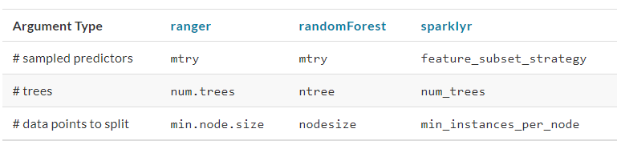
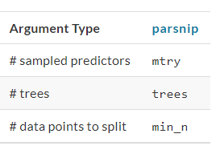
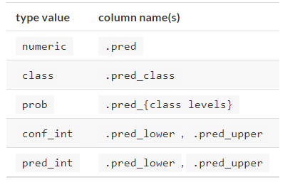

# Class Notes

1. Model of the Week: Regularized Linear Regression

a. Regression (cts outcome)

b. Mechanistic

c. Possible Goals: predictive

d. Tuning Parameters: Lambda 

e. Performance Measure(s)

(1) RSE (residual standard error)

(2) $R^{2}$

(3) MSE (mean squared error)

# Basics
## CHAPTER 7 Fitting Models with Parsnip

1. The `parsnip` package provides a fluent and standard interface for a variety of different models. 

### 7.1 Create a Model

1. Once the data have been encoded in a format ready for a modeling algorithm, such as a numeric matrix, they can be used in the model building process.

a. A linear regression model is equivalent to: specify the outcome data as numeric, the predictors are related to the model in terms of simple slopes and intercepts:

$y_{i} = \beta_{0} + \beta_{1}x_{1i} + ... +\beta_{p}x_{pi}$

 

(1) Methods to estimate the model parameters:

(a) Ordinary linear regression: uses the traditional method of least squares to solve for the model parameters.

<1> The `stats` package can be used for the linear regression model case. The syntax for `lm()` is:

`model <- lm(formula, data, ...)`

* `...` symbolizes other options to pass to `lm()`.

* The function does not have an `x/y` interface where we might pass in our outcome as `y` and our predictor `x`.

(b) Regularized linear regression: adds a penalty to the least squares method to encourage simplicity by removing predictors and/or shrinking their coefficients towards zero. This can be executed using Bayesian or non-Bayesian techniques.

<1> To estimate with regularization, a Bayesian model can be fit using the `rstanarm` package:

`model <- stan_glm(formula, data, family = "gaussian", ...)`

* The other options passed via `...` would include arguments for the _prior distributions_ of the parameters as well as specifics about the numerical aspects of the model. 

* As with `lm()`, only the formula interface is available. 

<2> A popular non-Bayesian approach to regularize regression is the glmnet model:

`model <- glmnet(x = matrix, y = vector, family = "gaussian", ...)`

* In this case, the predictor data must already be formatted into a numeric matrix; there is only an `x/y` method and no formjla method.


*Note:*

+ These interfaces are heterogeneous in either how the data are passed to the model function or in terms of their arguments: 

- To fit models across different packages, the data must be formatted in different ways. `lm()` and `stan_glm()` only have formula interfaces while `glmnet()` does not. For other types of models, the interfaces may be even more disparate. 

2. For tidymodels, the approach to specifying a model is intended to be more unified:

a. *Specify the type of model based on its mathematical structure*: e.g., linear regression, random forest, K-nearest neighbors, etc.

b. *Specify the engine for fitting the model*: most often this reflects the software package that should be used.

c. *When required, declare the mode of the model*: the mode reflects the type of prediction outcome. 

(1) For numeric outcomes: the mode is _regression_; 

(2) For qualitative outcomes: the mode is _classification_. 

If a model can only create one type of model, such as linear regression, the mode is already set.

d. These specifications are built without referencing the data.

```{r eval = FALSE}

linear_reg() %>% set_engine("lm")
#> Linear Regression Model Specification (regression)
#> 
#> Computational engine: lm

linear_reg() %>% set_engine("glmnet") 
#> Linear Regression Model Specification (regression)
#> 
#> Computational engine: glmnet

linear_reg() %>% set_engine("stan")
#> Linear Regression Model Specification (regression)
#> 
#> Computational engine: stan

```


3. Once the details of the model have been specified, the model estimation can be done with either the `fit()` function (to use a formula) or the `fit_xy()` function (when your data are already pre-processed). 

a. The `parsnip` package allows the user to be indifferent to the interface of the underlying model; you can always use a formula even if the modeling package’s function only has the `x/y` interface.

b. The `translate()` function can provide details on how parsnip converts the user’s code to the package’s syntax:

```{r eval = FALSE}

linear_reg() %>% set_engine("lm") %>% translate()
#> Linear Regression Model Specification (regression)
#> 
#> Computational engine: lm 
#> 
#> Model fit template:
#> stats::lm(formula = missing_arg(), data = missing_arg(), weights = missing_arg())

linear_reg() %>% set_engine("glmnet") %>% translate()
#> Linear Regression Model Specification (regression)
#> 
#> Computational engine: glmnet 
#> 
#> Model fit template:
#> glmnet::glmnet(x = missing_arg(), y = missing_arg(), weights = missing_arg(), 
#>     family = "gaussian")

linear_reg() %>% set_engine("stan") %>% translate()
#> Linear Regression Model Specification (regression)
#> 
#> Computational engine: stan 
#> 
#> Model fit template:
#> rstanarm::stan_glm(formula = missing_arg(), data = missing_arg(), 
#>     weights = missing_arg(), family = stats::gaussian, refresh = 0)

```


*Note:* 

+ `missing_arg()` is just a placeholder for the data that has yet to be provided.

+ For the `Stan` and `glmnet` engines, the `family` argument was automatically added as a default. As will be shown below, this option can be changed.

4. Example: predict the sale price of houses in the Ames data as a function of only longitude and latitude.

```{r eval = FALSE}

lm_model <- 
  linear_reg() %>% 
  set_engine("lm")

lm_form_fit <- 
  lm_model %>% 
  # Recall that Sale_Price has been pre-logged
  fit(Sale_Price ~ Longitude + Latitude, data = ames_train)

lm_xy_fit <- 
  lm_model %>% 
  fit_xy(
    x = ames_train %>% select(Longitude, Latitude),
    y = ames_train %>% pull(Sale_Price)
    )
    
lm_form_fit
#> parsnip model object
#> 
#> Fit time:  4ms 
#> 
#> Call:
#> stats::lm(formula = Sale_Price ~ Longitude + Latitude, data = data)
#> 
#> Coefficients:
#> (Intercept)    Longitude     Latitude  
#>     -316.37        -2.08         3.01
lm_xy_fit
#> parsnip model object
#> 
#> Fit time:  1ms 
#> 
#> Call:
#> stats::lm(formula = ..y ~ ., data = data)
#> 
#> Coefficients:
#> (Intercept)    Longitude     Latitude  
#>     -316.37        -2.08         3.01

```


*Note:*

+ Differences between `fit()` and `fit_xy()`: 

- When `fit()` is used with a model specification, this almost always means that dummy variables will be created from qualitative predictors. 

-- If the underlying function requires a matrix (like `glmnet`), it will make them. 

-- If the underlying function uses a formula, `fit()` just passes the formula to that function. We estimate that 99% of modeling functions using formulas make dummy variables. The other 1% include tree-based methods that do not require purely numeric predictors.

- The `fit_xy()` function always passes the data as-is to the underlying model function. It will not create dummy variables before doing so.

5. Not only does `parsnip` enable a consistent model interface for different packages, it also provides consistency in the model arguments. 

a. It is common for different functions which fit the same model to have different argument names:

(1) Example: random forest model functions: three commonly used arguments are: the number of trees in the ensemble, the number of predictors to randomly sample with each split within a tree, and the number of data points required to make a split. For three different R packages implementing this algorithm, those arguments are:



b. `parsnip` uses common arguments names within and between packages. 

(1) Example: random forest model functions: `parsnip` models use:



c. The `parsnip` argument names have also been standardized with similar recipe arguments: Our rule of thumb when standardizing argument names is:

*If a practitioner were to include these names in a plot or table, would the people viewing those results understand the name?*

d. To understand how the `parsnip` argument names map to the original names, use the help file for the model (available via `?rand_forest`) as well as the `translate()` function:

```{r eval = FALSE}

rand_forest(trees = 1000, min_n = 5) %>% 
  set_engine("ranger") %>% 
  set_mode("regression") %>% 
  translate()
#> Random Forest Model Specification (regression)
#> 
#> Main Arguments:
#>   trees = 1000
#>   min_n = 5
#> 
#> Computational engine: ranger 
#> 
#> Model fit template:
#> ranger::ranger(x = missing_arg(), y = missing_arg(), case.weights = missing_arg(), 
#>     num.trees = 1000, min.node.size = min_rows(~5, x), num.threads = 1, 
#>     verbose = FALSE, seed = sample.int(10^5, 1))

```


6. Modeling functions in `parsnip` separate model arguments into two categories:

a. Main arguments: more commonly used and tend to be available across engines.

b. Engine arguments: either specific to a particular engine or used more rarely.

c. Example: in the translation of the random forest code above, the arguments `num.threads`, `verbose`, and `seed` were added by default. These arguments are specific to the ranger implementation of random forest models and wouldn’t make sense as main arguments. 

d. Engine-specific arguments can be specified in `set_engine()`. 

(1) Example: to have the `ranger::ranger()` function print out more information about the fit:

```{r eval = FALSE}

rand_forest(trees = 1000, min_n = 5) %>% 
  set_engine("ranger", verbose = TRUE) %>% 
  set_mode("regression") 
#> Random Forest Model Specification (regression)
#> 
#> Main Arguments:
#>   trees = 1000
#>   min_n = 5
#> 
#> Engine-Specific Arguments:
#>   verbose = TRUE
#> 
#> Computational engine: ranger

```


### 7.2 Use the Model Results

1. Once the model is created and fit, we can use the results in a variety of ways.

a. Might want to plot, print, or otherwise examine the model output.

b. Several quantities are stored in a `parsnip` model object, including the fitted model. This can be found in an element called `fit`, which can be returned using the `purrr::pluck()` function:

```{r eval = FALSE}

lm_form_fit %>% pluck("fit")
#> 
#> Call:
#> stats::lm(formula = Sale_Price ~ Longitude + Latitude, data = data)
#> 
#> Coefficients:
#> (Intercept)    Longitude     Latitude  
#>     -316.37        -2.08         3.01

```

c. Normal methods can be applied to this object, such as printing, plotting, and so on:

```{r eval = FALSE}
lm_form_fit %>% pluck("fit") %>% vcov()
#>             (Intercept)  Longitude   Latitude
#> (Intercept)     221.763  1.6944060 -1.5009965
#> Longitude         1.694  0.0177914 -0.0006748
#> Latitude         -1.501 -0.0006748  0.0342053
```


*Note:*

+ Never pass the `fit` element of a `parsnip` model to a model prediction function, e.g., use `predict(lm_form_fit)` but do not use `predict(lm_form_fit$fit)`. 

+ If the data were preprocessed in any way, incorrect predictions will be generated (sometimes, without errors). The underlying model’s prediction function has no idea if any transformations have been made to the data prior to running the model. 


2. Issues with some existing methods in base R: the results are stored in a manner that may not be the most useful. 

a. Example: `summary()` method for `lm` objects can be used to print the results of the model fit, including a table with parameter values, their uncertainty estimates, and p-values. These particular results can also be saved:

```{r eval = FALSE}
model_res <- 
  lm_form_fit %>% 
  pluck("fit") %>% 
  summary()

# The model coefficient table is accessible via the `coef` method.
param_est <- coef(model_res)
class(param_est)
#> [1] "matrix" "array"
param_est
#>             Estimate Std. Error t value  Pr(>|t|)
#> (Intercept) -316.368    14.8917  -21.24 3.040e-91
#> Longitude     -2.083     0.1334  -15.62 3.215e-52
#> Latitude       3.010     0.1849   16.27 2.585e-56
```

*Note:*

+ The object is a numeric matrix. This data structure was mostly likely chosen since all of the calculated results are numeric and a matrix object is stored more efficiently than a data frame. 

+ The non-numeric data (the labels for the coefficients) are contained in the row names. Keeping the parameter labels as row names is very consistent with the conventions in the original S language.


+ Complications: 

- When creating a visualization of the parameters values, we have to convert the parameter matrix to a data frame, which requires adding the row names as a column so that they can be used in a plot. However, several of the existing matrix column names would not be valid R column names for ordinary data frames (e.g. "Pr(>|t|)". 

- The consistency of the column names. For `lm` objects, the column for the test statistic is "Pr(>|t|)", but for other models, a different test might be used and, as a result, the column name would be different (e.g., "Pr(>|z|)") and the type of test would be encoded in the column name.

- The matrix is not a highly reusable data structure mostly because it constrains the data to be of a single type (e.g. numeric). 

- Keeping some data in the dimension names is also problematic since those data must be extracted to be of general use.

+ Solutions: The `broom` package has methods to convert many types of model objects to a tidy structure. 

- Example: using the `tidy()` method on the linear model produces:

```{r eval = FALSE}
tidy(lm_form_fit)
#> # A tibble: 3 x 5
#>   term        estimate std.error statistic  p.value
#>   <chr>          <dbl>     <dbl>     <dbl>    <dbl>
#> 1 (Intercept)  -316.      14.9       -21.2 3.04e-91
#> 2 Longitude      -2.08     0.133     -15.6 3.21e-52
#> 3 Latitude        3.01     0.185      16.3 2.58e-56
```

-- The column names are standardized across models and do not contain any additional data (such as the type of statistical test). 

-- The data previously contained in the row names are now in a column called terms and so on. One important principle in the `tidymodels` ecosystem is that a function should return values that are _predictable_, _consistent_, and _unsurprising_.

### 7.3 Make Predictions

1. Difference between `parsnip` and conventional R modeling functions: the format of values returned from `predict()`. 

a. For predictions, `parsnip` always conforms to the following rules:

(1) The results are always a tibble.

(2) The column names of the tibble are always predictable.

The predictable column names for different types of predictions are:


(3) There are always as many rows in the tibble as there are in the input data set.

Example: 

```{r eval = FALSE}
ames_test_small <- ames_test %>% slice(1:5)
predict(lm_form_fit, new_data = ames_test_small)
#> # A tibble: 5 x 1
#>   .pred
#>   <dbl>
#> 1  5.22
#> 2  5.29
#> 3  5.28
#> 4  5.26
#> 5  5.24
```

(4) The row order of the predictions are always the same as the original data.

(5) Rule (1)-(3) make it easier to merge predictions with the original data:

```{r eval = FALSE}

ames_test_small %>% 
  select(Sale_Price) %>% 
  bind_cols(predict(lm_form_fit, ames_test_small)) %>% 
  # Add 95% prediction intervals to the results:
  bind_cols(predict(lm_form_fit, ames_test_small, type = "pred_int")) 
#> # A tibble: 5 x 4
#>   Sale_Price .pred .pred_lower .pred_upper
#>        <dbl> <dbl>       <dbl>       <dbl>
#> 1       5.39  5.22        4.90        5.53
#> 2       5.28  5.29        4.97        5.60
#> 3       5.27  5.28        4.96        5.59
#> 4       5.60  5.26        4.95        5.58
#> 5       5.02  5.24        4.93        5.55
```


### 7.4 Parsnip-adjacent Packages

1. The `parsnip` package itself contains interfaces to a number of models. 
2. There are other tidymodels packages that have parsnip model definitions for other sets of models:

a. `discrim` package: has model definitions for the set of classification techniques called discriminant analysis methods (such as linear or quadratic discriminant analysis). In this way, the package dependencies required for installing parsnip are reduced. 

### 7.5 Chapter Summary

1. The `parsnip` package provides a common interface for models across R packages using a standard syntax. The interface and resulting objects have a predictable structure.
