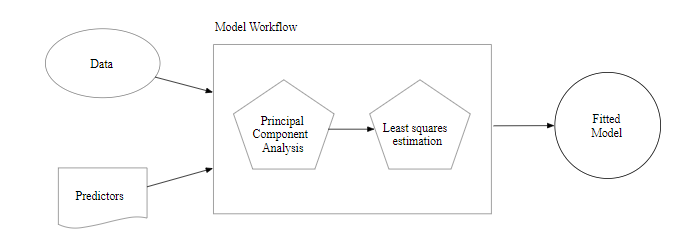

# Basics
## CHAPTER 8 A Model Workflow
1. This chapter will introduce a new object called a _model workflow_. 
a. The purpose of this object is to encapsulate the major pieces of the modeling process. 

b. The workflow is important in two ways:

(1) Using a workflow object encourages good methodlogy since it is a single point of entryto the estimation components of a data analysis. 

(2) It enables the user to better oranize their projects. 

### 8.1 Where Does a Model Begin and End?

1. So far the term "the model" refers to a structural equaiton that relates some predictors to one or more outcomes. 

a. Example: Linear Model: linear regression

Outcome Data: denoted as $y_{i}, i = 1, 2, ..., n$. There are $n$ samples in the training set. 

Predictors: suppose there are $p$ predictors denoted by $x_{i1}, ..., x_{ip}$.

Linear Regression Model Equation: $\hat{y}_{i} = \hat{\beta}_{0} + \hat{\beta}_{1}x_{i1} + ... + \hat{\beta}_{p}x_{ip}$.

*Note*: 

+ While this is a linear model, it is only linear in the parameters not in the predictors. The predictors could be nonlinear terms such as $\log(x_{i})$.

2. The conventional way of thinking about the modeling process is that it only includes the model fit.

a. For some data sets, fitting the model itself may be the entire modeling process.

b. For other data sets, there are a variety of choices and additional steps that often occur _before_ the model is fit:

(1) Select Predictors: common to start with more than $p$ predictors and exclude some predictors through EDA, using domain knowledge or using a feature selection algorithm to make a data-driven choice for the minimum predictor set for the model. 

(2) Dealt with Missing Values: missing value could be _imputed_ using other values in the data. 

(a) Example: if $x_{1}$ were issing but was correlated with predictors $x_{2}, x_{3}$, an imputation method could estimate the missing $x_{1}$ observation from the values of $x_{2}, x_{3}$.

(3) Transform Predictors: 

(a) Transform the scale of a predictor: using a priori information on what the new scale should be or estimate the proper scale using a statistical transformation technique, the existing data, and some optimization criterion.

(b) Take groups of predictors and transform them into new features that are used as the predictors. This often happens in PCA. 

c. There are also choices and additional steps that often occur _after_ the model is fit:

(1) Hard Prediction: use a 50% probability cutoff to create a discreate classs prediction known as a "hard prediction" for the binary outcome (e.g. event v.s. non-event) in a classification model. 


3. The model workflow is the borader modeling process that include any preprocessing steps, the model fit itself, and potential post-processing activities. 

a. In other software, such as Python or Spark, similar collections of steps are called _pipelines_. 

b. In tidymodels, the term “pipeline” already connotes a sequence of operations chained together with a pipe operator (such as `%>%`). 

(1) We will call the sequence of computational operations related to modeling _workflows_.


4. The _workflow_ must include all significant estimation steps. 


5. Example: PCA Signal Extraction: a way to replace correlated predictors with new artificial features that are uncorrelated and capture most of the information in the original set. The new features would be used as the predictors and least squares regression could be used to estimate the model parameters.

Model Workflow:



*Note:* 

+ The PCA preprocessing is part of the modeling process. 

### 8.2 Workflow Basics

1. The `workflows` package allows the user to bind modeling and preprocessing objects together. 

2. Example: Ames Data

```{r eval = FALSE}

library(tidymodels)  # Includes the workflows package

lm_model <- 
  linear_reg() %>% 
  set_engine("lm")

```

a. A workflow always requires a `parsnip` model object:
```{r eval = FALSE}

lm_wflow <- 
  workflow() %>% 
  add_model(lm_model)

lm_wflow
#> ══ Workflow ═════════════════════════════════════════════════════════════════════════
#> Preprocessor: None
#> Model: linear_reg()
#> 
#> ── Model ────────────────────────────────────────────────────────────────────────────
#> Linear Regression Model Specification (regression)
#> 
#> Computational engine: lm

```


b. Notice that we have not yet specified how this workflow should preprocess the data: `Preprocessor: None`.

(1) If our model were very simple, a standard R formula can be used as a preprocessor:

```{r eval = FALSE}

lm_wflow <- 
  lm_wflow %>% 
  add_formula(Sale_Price ~ Longitude + Latitude)

lm_wflow
#> ══ Workflow ═════════════════════════════════════════════════════════════════════════
#> Preprocessor: Formula
#> Model: linear_reg()
#> 
#> ── Preprocessor ─────────────────────────────────────────────────────────────────────
#> Sale_Price ~ Longitude + Latitude
#> 
#> ── Model ────────────────────────────────────────────────────────────────────────────
#> Linear Regression Model Specification (regression)
#> 
#> Computational engine: lm

```


c. Workflows have a `fit()` method that can be used to create the model. Using the objects create in Section 7.5:

```{r eval = FALSE}

lm_fit <- fit(lm_wflow, ames_train)
lm_fit
#> ══ Workflow [trained] ═══════════════════════════════════════════════════════════════
#> Preprocessor: Formula
#> Model: linear_reg()
#> 
#> ── Preprocessor ─────────────────────────────────────────────────────────────────────
#> Sale_Price ~ Longitude + Latitude
#> 
#> ── Model ────────────────────────────────────────────────────────────────────────────
#> 
#> Call:
#> stats::lm(formula = ..y ~ ., data = data)
#> 
#> Coefficients:
#> (Intercept)    Longitude     Latitude  
#>     -316.37        -2.08         3.01

```

d. We can also use `predict()` on the fitted workflow:

```{r eval = FALSE}
predict(lm_fit, ames_test %>% slice(1:3))
#> # A tibble: 3 x 1
#>   .pred
#>   <dbl>
#> 1  5.22
#> 2  5.29
#> 3  5.28
```

e. Both the model and preprocessor can be removed or updated:

Note that, in this new object, the output shows that the previous fitted model was removed since the new formula is inconsistent with the previous model fit.

```{r eval = FALSE}
lm_fit %>% update_formula(Sale_Price ~ Longitude)
#> ══ Workflow ═════════════════════════════════════════════════════════════════════════
#> Preprocessor: Formula
#> Model: linear_reg()
#> 
#> ── Preprocessor ─────────────────────────────────────────────────────────────────────
#> Sale_Price ~ Longitude
#> 
#> ── Model ────────────────────────────────────────────────────────────────────────────
#> Linear Regression Model Specification (regression)
#> 
#> Computational engine: lm
```

### 8.3 Workflow and Recipes

1. Instead of using model formulas, `recipe` objects can also be used to preprocess data for modeling. 

a. Example: Ames Data

(1) The recipe object `ames_rec` encapsulated several specified preprocessing and feature engineering steps. We will attach it to the workflow: 

```{r eval = FALSE}

lm_wflow %>% 
  add_recipe(ames_rec)
#> Error: A recipe cannot be added when a formula already exists.

```

That did not work! We can only have one preprocessing method at a time, so we need to remove the formula before adding the recipe.

```{r eval = FALSE}

lm_wflow <- 
  lm_wflow %>% 
  remove_formula() %>% 
  add_recipe(ames_rec)
lm_wflow
#> ══ Workflow ═════════════════════════════════════════════════════════════════════════
#> Preprocessor: Recipe
#> Model: linear_reg()
#> 
#> ── Preprocessor ─────────────────────────────────────────────────────────────────────
#> 5 Recipe Steps
#> 
#> ● step_log()
#> ● step_other()
#> ● step_dummy()
#> ● step_interact()
#> ● step_ns()
#> 
#> ── Model ────────────────────────────────────────────────────────────────────────────
#> Linear Regression Model Specification (regression)
#> 
#> Computational engine: lm

```


(2) We described the `prep()`, `bake()`, and `juice()` functions for using the recipe with a modeling function. This can be onerous, so the `fit()` method for workflow objects automates this process:

```{r eval = FALSE}

# Does `prep()`, `juice()`, and `fit()` in one step:
lm_fit <- fit(lm_wflow, ames_train)

# Does `bake()` and `predict()` automatically:
predict(lm_fit, ames_test %>% slice(1:3))
#> # A tibble: 3 x 1
#>   .pred
#>   <dbl>
#> 1  5.31
#> 2  5.30
#> 3  5.17
```

(3) If we need the bare model object or recipe, there are pull_* functions that can retrieve them:

```{r eval = FALSE}

# Get the recipe and run `tidy()` method: 
lm_fit %>% 
  pull_workflow_prepped_recipe() %>% 
  tidy()
#> # A tibble: 5 x 6
#>   number operation type     trained skip  id            
#>    <int> <chr>     <chr>    <lgl>   <lgl> <chr>         
#> 1      1 step      log      TRUE    FALSE log_u4pZz     
#> 2      2 step      other    TRUE    FALSE other_XqiIK   
#> 3      3 step      dummy    TRUE    FALSE dummy_ht3jv   
#> 4      4 step      interact TRUE    FALSE interact_K2XxD
#> 5      5 step      ns       TRUE    FALSE ns_vqtIn

# To tidy the model fit: 
lm_fit %>% 
  # This returns the parsnip object:
  pull_workflow_fit() %>% 
  # Now tidy the linear model object:
  tidy() %>% 
  slice(1:5)
#> # A tibble: 5 x 5
#>   term                       estimate std.error statistic   p.value
#>   <chr>                         <dbl>     <dbl>     <dbl>     <dbl>
#> 1 (Intercept)                -0.531    0.296        -1.79 7.32e-  2
#> 2 Gr_Liv_Area                 0.648    0.0161       40.3  1.46e-264
#> 3 Year_Built                  0.00194  0.000139     13.9  2.69e- 42
#> 4 Neighborhood_College_Creek -0.0898   0.0332       -2.71 6.83e-  3
#> 5 Neighborhood_Old_Town      -0.0516   0.0129       -4.01 6.20e-  5

```


### 8.4 How Does a Workflow Use the Formula?

1. The formula method has multiple purposes: one of these is to properly encode the original data into an analysis ready format. 

a. This can involve:

* Executing in-line transformations (e.g., `log(x)`)

* Creating dummy variable columns

* Creating interactions or other column expansions

b. However, there are many statistical methods that require different types of encodings:

* Most packages for tree-based models use the formula interface but do not encode the categorical predictors as dummy variables.

* Packages can use special in-line functions that tell the model function how to treat the predictor in the analysis. 

+ Example: in survival analysis models, a formula term such as `strata(site)` would indicate that the column `site` is a stratification variable. This means that it should not be treated as a regular predictor and does not have a corresponding location parameter estimate in the model.

* A few R packages have extended the formula in ways that base R functions cannot parse or execute. 

+ Example: in multilevel models (e.g. mixed models or hierarchical Bayesian models), a model term such as `(week | subject)` indicates that the column `week` is a random effect that has different slope parameter estimates for each value of the `subject` column.

2. A workflow is a general purpose interface. When `add_formula()` is used, how should the workflow pre-process the data? Since the preprocessing is model dependent, workflows attempts to emulate what the underlying model would do whenever possible. If it is not possible, the formula processing should not do anything to the columns used in the formula. 

a. Tree-based Models

(1) When we fit a tree to the data, the `parsnip` package understands what the modeling function would do.

(a) Example: if a random forest model is fit using the `ranger` or `randomForest` packages, the workflow knows predictors columns that are factors should be left as-is.

(b) Counter Example: a boosted tree created with the `xgboost` package requires the user to create dummy variables from factor predictors (since `xgboost::xgb.train()` will not). This requirement is embedded into the model specification object and a workflow using `xgboost` will create the indicator columns for this engine. Also note that a different engine for boosted trees, C5.0, does not require dummy variables so none are made by the workflow.

(c) This determination is made for _each model_ and _engine_ combination.


b. Special Formulas and In-line Funtions

(1) A number of multilevel models have standardized on a formula specification devised in the `lme4` package. 

(a) Example: to fit a regression model that has random effects for subjects, we would use the following formula:

```{r eval= FALSE}
library(lme4)
lmer(distance ~ Sex + (age | Subject), data = Orthodont)
```


The effect of this is that each subject will have an estimated intercept and slope parameter for `age`.

<2> The problem is that standard R methods can’t properly process this formula:

```{r eval = FALSE}
model.matrix(distance ~ Sex + (age | Subject), data = Orthodont)
#> Warning in Ops.ordered(age, Subject): '|' is not meaningful for ordered factors
#>      (Intercept) SexFemale age | SubjectTRUE
#> attr(,"assign")
#> [1] 0 1 2
#> attr(,"contrasts")
#> attr(,"contrasts")$Sex
#> [1] "contr.treatment"
#> 
#> attr(,"contrasts")$`age | Subject`
#> [1] "contr.treatment"
```

The result is a zero row data frame.

*Note:*

+ The issue is that the special formula has to be processed by the underlying package code, not the standard `model.matrix()` approach.

+ Even if this formula could be used with `model.matrix()`, this would still present a problem since the formula also specifies the statistical attributes of the model.

<2> The solution in workflows is an optional supplementary model formula that can be passed to `add_model()`. 

- Example: using the `strata()` function in the `survival` package, the `add_formula()` specification provides the bare column names and then the actual formula given to the model is set within `add_model()`:

```{r eval = FALSE}

library(survival)

parametric_model <- 
  surv_reg() %>% 
  set_engine("survival")

parametric_workflow <- 
  workflow() %>% 
  # This formula passes the data along as-is: 
  add_formula(futime + fustat ~ age + rx) %>% 
  add_model(parametric_model, 
            # This formula is given to the model
            formula = Surv(futime, fustat) ~ age + strata(rx))

random_effects <- fit(parametric_workflow, data = ovarian)
random_effects
#> ══ Workflow [trained] ═══════════════════════════════════════════════════════════════
#> Preprocessor: Formula
#> Model: surv_reg()
#> 
#> ── Preprocessor ─────────────────────────────────────────────────────────────────────
#> futime + fustat ~ age + rx
#> 
#> ── Model ────────────────────────────────────────────────────────────────────────────
#> Call:
#> survival::survreg(formula = Surv(futime, fustat) ~ age + strata(rx), 
#>     data = data, model = TRUE)
#> 
#> Coefficients:
#> (Intercept)         age 
#>     12.8734     -0.1034 
#> 
#> Scale:
#>   rx=1   rx=2 
#> 0.7696 0.4704 
#> 
#> Loglik(model)= -89.4   Loglik(intercept only)= -97.1
#>  Chisq= 15.36 on 1 degrees of freedom, p= 9e-05 
#> n= 26

```

Notice how, in the call printed above, the model-specific formula was used.

<3> As an alternative to using two formulas, we could use a straightforward recipe instead:

```{r eval = FALSE}
parametric_workflow <- 
  workflow() %>% 
  add_recipe(recipe(futime + fustat ~ age + rx, data = ovarian)) %>% 
  add_model(parametric_model, 
            formula = Surv(futime, fustat) ~ age + strata(rx))

# No errors:
random_effects <- fit(parametric_workflow, data = ovarian)
```


### 8.5 Future Plans

1. A workflow can accept two types of preprocessors: 

a. A model formula

b. A recipe

(1) Recipes are very flexible, but they do not encompass everything that a modeling practitioner might want to do to the data prior to modeling. 

(a) Example: a supervised feature filter might be of interest. Such a filter would screen predictors against the outcome using the training set and use the results to remove the least relevant predictors. In the future, a specification for this type of pre-model operation will be passed to a workflow to include it in the modeling process. This is a critical step that can have a profound effect on model performance. As discussed in the next chapter, a common pitfall in modeling is to exclude this step from the model evaluation process.

2. There are also operations that might occur _after_ the model is fit. 

(a) Example: cutoff selection for two-class problems. Previously in this chapter, we discussed the idea of modifying the cutoff for a two-class problem. In the future, workflows will be able to attach a custom cutoff that is applied to probabilities after the model fit. Other approaches, such as probability calibration, could also be added as post-processors


### 8.6 Chapter Summary

1. The modeling process encompasses more than just estimating the parameters of an algorithm that connects predictors to an outcome. This process also includes preprocessing steps, such as those outlined in Chapter 6, and operations taken after a model is fit. We introduced a concept called a model workflow that can capture the important components of the modeling process.
