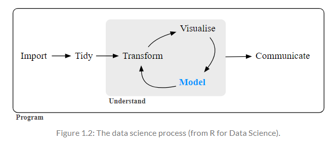
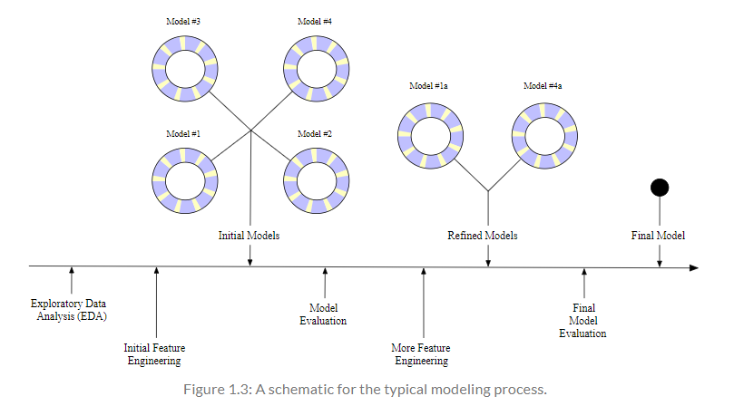
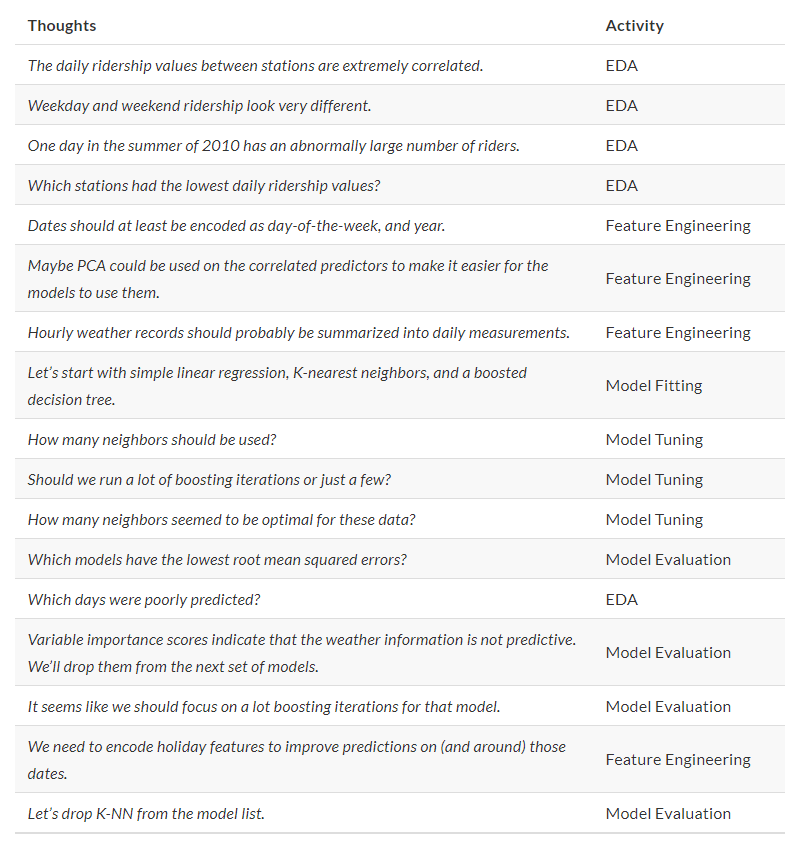

# Hello World

## CHAPTER 1 Software for Modeling

1. Models are mathematical tools that can describe a system and capture relationships in the data given to them.

a. Models can be used for predicting future events, determining if there is a difference between several groups, aiding map-based visualization, discovering novel patterns in the data that could be further investigtaed, etc. 

b. The utility of a model hinges on its ability to be **reductive**. 

c. The primary influences in the data can be captured mathematically in a useful way, such as in a relationship that can be expressed as an equation. 

### 1.1 Types of Models

A. **Descriptive Models**

1. The purpose of a descriptive model is to describe or illustrate characteristics of some data. 

a. Probe-level Model (PLM): a statistical model would be created that accounted for the known differences in the data. If there were other, unknown factors in the data, these effects would be captured in the model residuals. The model can be used to illustrate specific patterns. 

b. Locally Estimated Scatterplot Smoothing Model (LOESS Model): a smooth and flexible regression model is fit to a dataset, usually with a single independent variable, and the fitted regression line is used to elucidate some trend in the data. 

(1) These types of smoothers are used to discover potential ways to represent a variable in a model. 

B. **Influential Models**

1. The goal of an inferential model is to produce a decision for a research question or to test a specific hypothesis.

2. The goal is to make some statment of truth regarding a predefined conjecture or idea. In many (but not all) cases, a qualitative statment is produced (e.g. that a difference was "statistically significant").

3. Inferential techniques typically produce some type of probabilistic output, such as a p-value, confidence interval, or posterior probability.

a. Generally, to compute such a quantity, formal probabilistic assumptions must be made about the data and the underlying processes that generated the data. 

b. The quality of the statistical results are highly dependent on these pre-defined assumptions as well as how much the observed data appear to agree with them. 

c. The most critical factors here are theoretical in nature: "If my data were independent and follow distribution X, then test statistic Y can be used to produce a p-value. Otherwise, the resulting p-value might be inaccurate."

4. One aspect of inferential analyses is that there tends to be a delayed feedback loop in understanding how well the data matches the assumptions. 

C. **Predictive Models**

1. Sometimes data are modeled to produce the most accurate prediction possible for new data. Here, the primary goal is that the predicted values have the highest possible fidelity to the true value of the new data. 

2. For this type of model, the problem type is one of __estimation__ rather than inference. (e.g. Interested "how many copies of book X will customers purchase next month?" NOT "will I sell more than 100 copies of book X next month?")

3. Also, depending on the context, there may not be any interest in why the predicted value is X. In other words, there is more interest in the value itself than evaluting a formal hypothesis related to the data. 

4. The prediction can also include measures of uncertainty. (e.g. Providing a forecasting error may be helpful in deciding how many copies of book X to purchase.) It can also serve as a metric to gauge how well the prediction method worked. 

5. There are many ways that a predictive model can be created, so the important factors depend on how the model was developed. 

a. Mechanistic Model: could be derived using first principles to produce a model equation that is dependent on assumptions. Data are used to estimate the unknown parameters of this equation so that predictions can be generated. 
(1) Like inferential models, mechanistic predictive models greatly depend on the assumptions that define their model equations. However, unlike inferential models, it is easy to make data-driven statements about how well the model performs based on how well it predicts the existing data. 

(2) Here the feedback loop for the modeling practitioner is much faster than it would be for a hypothesis test. 

b. Empirically Driven Models: created with more vague assumptions. These models tend to fall into the machine learning category. 

(1) A good example is the K-nearest neighbor (KNN) model. Given a set of reference data, a new sample is predicted by using the values of the K most similar data in the reference set.

(2) The primary method of evaluating the appropriateness of the model is to assess its accuracy using existing data. If the structure of this type of model was a good choice, the predictions would be close to the actual values. 

c. Ordinary Linear Regression Model: might fall into ay of these three classes of model (e.g. Descriptive Models, Inferential Models, Predictive Models), dependenting on how it is used:

(1) A descriptive smoother, similar to LOESS, called restricted smoothing splines can be sued to describe trends in data using ordinary linear regression with specialized terms. 

(2) An analysis of variance (ANOVA) model is a popular method for producing the p-value used for inference. ANOVA models are a special case of linear regression. 

(3) If a simple linear regression model produces highly accurate predictions, it can be used as a predictive model. 

6. There are many examples of predictive models that cannot or at least should not be sued for inference. Even if probabilistic assumptions were made for the data, the nature of the KNN model makes the math required for inference intractable. 

D. **Connections bewteen Models**

1. While the primary purpose of decriptive and inferential models might not be related to prediction, the predictive capacity of the model should not be ignored. 

a. For example, logistic regression is a popular model for data where the outcome is qualitative with two possible values. It can model how variables are related to the probability of the outcomes. 

(1) When used in an inferential manner, there is usually an abundance of attention paid to the statistical qualities of the model. 

(a) For example, analysts tend to strongly focus on the selection of which independent variables are contained in the model. 

(b) Many iterations of model building are usually used to determine a minimal subset of independent variables that have a "statistically significant" relationship to the outcome variable. This is usually achieved when all of the p-values for the independent variables are below some value (e.g. 0.05). 

(c) From here, the analyst typically focuses on making qualitative statements about the relative influence that the variables have on the outcome (e.g. There is a statistically significant relationship between age and the odds of heart disease.)

b. It can be dangerous when statistical significance is used as the __only__ measure of model quality. It is possible that this statistically optimized model has poor model accuracy, or perform poorly on some other measure of predictive capacity. 

(1) While the model might not be used for prediction, how much should inferences be trusted from a model that has significant p-values but dismal accuracy? 
Predictive performance tends to be related to how close the model's fitted values are to the observed data. 

(a) If a model has limited fidelity to the data, the inferences generated by the model should be highly suspect. In other words, statistical significance may not be sufficient proof that a model is appropriate. 

### 1.2 Some Terminology

A. **Supervised v.s. Unsupervised Model**

1. Unsupervised Models: those that learn patterns, clusters, or other characteristics of the data but lack an outcome variable (i.e. a dependent variable). They are used to understand relationships between variables or sets of variables without an explicit relationship between variables and an outcome. 

a. Examples: Principal Component Analysis (PCA), Clustering, and Autoencoders. 

2. Supervised Models: those that have an outcome variable.

a. Examples: Linear Regression, Neural Networks.

b. With supervised models, there are two main sub-categories:

(1) Regression: predicts a numeric outcome.

(2) Classification: predicts an outcome that is an ordered or unordered set of qualitative values.

B. **Data Types**

1. There are two main species of data which are quantitative and qualitative. 

a. QUantitative Data: real numbers like 3.14159 and integers like 42. 

b. Qualitative Data (Nominal Data): those represent some sort of discrete state that cannot be naturally placed on a numeric scale, like "red", "green", and "blue".

C. **Variables**

1. Different variables can have different __roles__ in an analysis. 

a. Outcomes (otherwise known as the labels, endpoints, or dependent variables): are the value being predicted in supervised models.

b. Independent Variables (also known as predictors, features, covariates): the substrate for making predictions of the outcome.

### 1.3 How Does Modeling Fit Into The Data Analysis Process?

A. **Critical Phases of Data Analysis Before Modeling**

1. Phase I Data Cleaning: there is the chronically underestimated process of cleaning the data. 

a. Should investigate the data to make sure that they are applicable to the project goals, accurate, and appropriate. 

b. Data cleaning can also overlap with Phase II understanding the data. 

2. Phase II Data Understanding: refers to as exploratory data analysis (EDA). EDA brings to light how the different variables are related to one another, their distributions, typical ranges, and other attributes. 

a. A good question to ask in Phase II: "How did I come by these data?" This question can help you understand how the data at hand have been sampled or filtered an if these operations were appropriate.

b. Another good quesiton to ask in Phase II: "Is the data relevant?"

3. Phase III Set Expectations and Performance Evaluation: before starting a data analysis process, there should be clear expectatios of the goal of the model and how performance (and success) will be judged. 

a. At least one __performance metric__ should be identified with realistic goals of what can be achieved. 

b. Common statistical metrics are classification accuracy, true and false positive rates, root mean squared error, and so on. 

c. The relative benefits and drawbacks of these metrics should be weighted. 

d. It is also important that the metric be germane; alignment with the broader data analysis goals is critical. 

B. **Illustration of the General Data Analysis Process**

1. Data ingestion and cleaning/tidying are shown as the initial steps. 

2. When the analytical steps for understanding commence, they are a heuristic process; we cannot pre-determine how long they may take. 

3. The cycle of analysis, modeling, and visualization often requires multiple iterations. 

C. **Typical Modelling Process Scheme**

1. The general phases for modeling are:

a. Exploratory Data Analysis (EDA): initially there is a back and forth between numerical analysis and visualization of the data where different discoveries lead to more questions and data analysis "side-quests" to gain more understanding. 

b. Feature Engineering: the understanding gained from EDA results in the creation of specific model terms that make it easier to accurately model the observed data. This can include complex methodologies (e.g. PCA) or simpler features (using the ratio of two predictors). 

c. Model Tuning and Selection (circles with blue and yellow segments in Fig 1.3): a variety of models are generated and their performance is comapred. SOme models require parameter turning where some structural parameters are required to be specified or optimized. The colored segments within the circles signify the repeated data splitting sued during resampling. 

d. Model Evaluation: during this phase of model development, we assess the model's performance metrics, examine residual plots, and conduct other EDA-like analyses to understand how well the model work. In some cases, formal between-model comparisons help you to understand whether any differences in models are within the experimental noise. 

2. Example: Modeling Process

### 1.4 Chapter Summary

1. This chapter focused on how models describe relationships in data, and different types of models such as __descriptive models__, __inferential models__, and __predictive models__. 

2. The predictive capacity of a model can be used to evaluate it, even when its main goal is not prediction. 

## CHAPTER 2 A Tidyverse Primer

1. The tidyverse is a collection of R packages for data analysis that are developed with common ideas and norms. 

### 2.1 Principes

#### 2.1.1 Design for Humans

