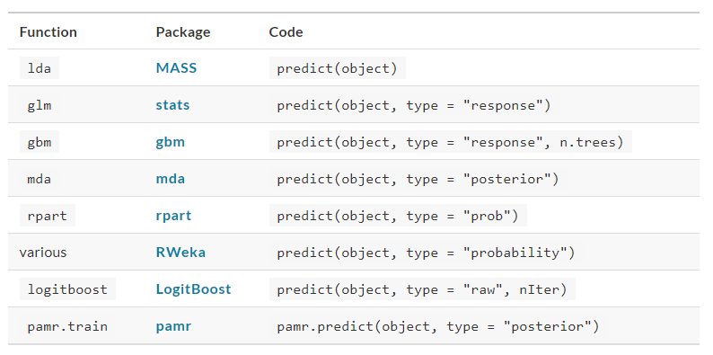

# Hello World

## CHAPTER 1 Software for Modeling


1. Models are mathematical tools that can describe a system and capture relationships in the data given to them.

a. Models can be used for predicting future events, determining if there is a difference between several groups, aiding map-based visualization, discovering novel patterns in the data that could be further investigtaed, etc. 

b. The utility of a model hinges on its ability to be **reductive**. 

c. The primary influences in the data can be captured mathematically in a useful way, such as in a relationship that can be expressed as an equation. 


### 1.1 Types of Models

A. **Descriptive Models**

1. The purpose of a descriptive model is to describe or illustrate characteristics of some data. 

a. Probe-level Model (PLM): a statistical model would be created that accounted for the known differences in the data. If there were other, unknown factors in the data, these effects would be captured in the model residuals. The model can be used to illustrate specific patterns. 

b. Locally Estimated Scatterplot Smoothing Model (LOESS Model): a smooth and flexible regression model is fit to a dataset, usually with a single independent variable, and the fitted regression line is used to elucidate some trend in the data. 

(1) These types of smoothers are used to discover potential ways to represent a variable in a model. 


B. **Influential Models**

1. The goal of an inferential model is to produce a decision for a research question or to test a specific hypothesis.

2. The goal is to make some statment of truth regarding a predefined conjecture or idea. In many (but not all) cases, a qualitative statment is produced (e.g. that a difference was "statistically significant").

3. Inferential techniques typically produce some type of probabilistic output, such as a p-value, confidence interval, or posterior probability.

a. Generally, to compute such a quantity, formal probabilistic assumptions must be made about the data and the underlying processes that generated the data. 

b. The quality of the statistical results are highly dependent on these pre-defined assumptions as well as how much the observed data appear to agree with them. 

c. The most critical factors here are theoretical in nature: "If my data were independent and follow distribution X, then test statistic Y can be used to produce a p-value. Otherwise, the resulting p-value might be inaccurate."

4. One aspect of inferential analyses is that there tends to be a delayed feedback loop in understanding how well the data matches the assumptions. 


C. **Predictive Models**

1. Sometimes data are modeled to produce the most accurate prediction possible for new data. Here, the primary goal is that the predicted values have the highest possible fidelity to the true value of the new data. 

2. For this type of model, the problem type is one of __estimation__ rather than inference. (e.g. Interested "how many copies of book X will customers purchase next month?" NOT "will I sell more than 100 copies of book X next month?")

3. Also, depending on the context, there may not be any interest in why the predicted value is X. In other words, there is more interest in the value itself than evaluting a formal hypothesis related to the data. 

4. The prediction can also include measures of uncertainty. (e.g. Providing a forecasting error may be helpful in deciding how many copies of book X to purchase.) It can also serve as a metric to gauge how well the prediction method worked. 

5. There are many ways that a predictive model can be created, so the important factors depend on how the model was developed. 

a. Mechanistic Model (parametric model): could be derived using first principles to produce a model equation that is dependent on assumptions. Data are used to estimate the unknown parameters of this equation so that predictions can be generated. 
(1) Like inferential models, mechanistic predictive models greatly depend on the assumptions that define their model equations. However, unlike inferential models, it is easy to make data-driven statements about how well the model performs based on how well it predicts the existing data. 

(2) Here the feedback loop for the modeling practitioner is much faster than it would be for a hypothesis test. 

b. Empirically Driven Models (non-parametric model): created with more vague assumptions. These models tend to fall into the machine learning category. 

(1) A good example is the K-nearest neighbor (KNN) model. Given a set of reference data, a new sample is predicted by using the values of the K most similar data in the reference set.

(2) The primary method of evaluating the appropriateness of the model is to assess its accuracy using existing data. If the structure of this type of model was a good choice, the predictions would be close to the actual values. 

c. Ordinary Linear Regression Model: might fall into ay of these three classes of model (e.g. Descriptive Models, Inferential Models, Predictive Models), dependenting on how it is used:

(1) A descriptive smoother, similar to LOESS, called restricted smoothing splines can be sued to describe trends in data using ordinary linear regression with specialized terms. 

(2) An analysis of variance (ANOVA) model is a popular method for producing the p-value used for inference. ANOVA models are a special case of linear regression. 

(3) If a simple linear regression model produces highly accurate predictions, it can be used as a predictive model. 


6. There are many examples of predictive models that cannot or at least should not be sued for inference. Even if probabilistic assumptions were made for the data, the nature of the KNN model makes the math required for inference intractable. 

D. **Connections bewteen Models**

1. While the primary purpose of decriptive and inferential models might not be related to prediction, the predictive capacity of the model should not be ignored. 

a. For example, logistic regression is a popular model for data where the outcome is qualitative with two possible values. It can model how variables are related to the probability of the outcomes. 

(1) When used in an inferential manner, there is usually an abundance of attention paid to the statistical qualities of the model. 

(a) For example, analysts tend to strongly focus on the selection of which independent variables are contained in the model. 

(b) Many iterations of model building are usually used to determine a minimal subset of independent variables that have a "statistically significant" relationship to the outcome variable. This is usually achieved when all of the p-values for the independent variables are below some value (e.g. 0.05). 

(c) From here, the analyst typically focuses on making qualitative statements about the relative influence that the variables have on the outcome (e.g. There is a statistically significant relationship between age and the odds of heart disease.)

b. It can be dangerous when statistical significance is used as the __only__ measure of model quality. It is possible that this statistically optimized model has poor model accuracy, or perform poorly on some other measure of predictive capacity. 

(1) While the model might not be used for prediction, how much should inferences be trusted from a model that has significant p-values but dismal accuracy? 
Predictive performance tends to be related to how close the model's fitted values are to the observed data. 

(a) If a model has limited fidelity to the data, the inferences generated by the model should be highly suspect. In other words, statistical significance may not be sufficient proof that a model is appropriate. 


### 1.2 Some Terminology

A. **Supervised v.s. Unsupervised Model**

1. Unsupervised Models (Data-driven with unlabelled data): those that learn patterns, clusters, or other characteristics of the data but lack an outcome variable (i.e. a dependent variable). They are used to understand relationships between variables or sets of variables without an explicit relationship between variables and an outcome. 


a. Examples: Principal Component Analysis (PCA) (reduce dimensions), Clustering (divide by similarity), and Autoencoders, Association (identify sequences), dimension reduction (wider dependencies).

b. Unsupervised learning usually happens during exploratory analysis. 


c. Objectives: pattern/structure recognition

2. Supervised Models (Task-driven with pre-cateogrized data ): those that have an outcome variable.

a. Examples: Regression (divde the ties by length), Neural Networks, classification (divide the socks by color)

b. With supervised models, there are two main sub-categories:

(1) Regression: predicts a numeric outcome.

(2) Classification: predicts an outcome that is an ordered or unordered set of qualitative values.

c. Objective: predictions & predictive models


B. **Data Types**

1. There are two main species of data which are quantitative and qualitative. 

a. QUantitative Data: real numbers like 3.14159 and integers like 42. 

b. Qualitative Data (Nominal Data): those represent some sort of discrete state that cannot be naturally placed on a numeric scale, like "red", "green", and "blue".


C. **Variables**

1. Different variables can have different __roles__ in an analysis. 

a. Outcomes (otherwise known as the labels, endpoints, or dependent variables): are the value being predicted in supervised models.

b. Independent Variables (also known as predictors, features, covariates): the substrate for making predictions of the outcome.


### 1.3 How Does Modeling Fit Into The Data Analysis Process?

A. **Critical Phases of Data Analysis Before Modeling**

1. Phase I Data Cleaning: there is the chronically underestimated process of cleaning the data. 

a. Should investigate the data to make sure that they are applicable to the project goals, accurate, and appropriate. 

b. Data cleaning can also overlap with Phase II understanding the data. 

2. Phase II Data Understanding: refers to as exploratory data analysis (EDA). EDA brings to light how the different variables are related to one another, their distributions, typical ranges, and other attributes. 

a. A good question to ask in Phase II: "How did I come by these data?" This question can help you understand how the data at hand have been sampled or filtered an if these operations were appropriate.

b. Another good quesiton to ask in Phase II: "Is the data relevant?"

3. Phase III Set Expectations and Performance Evaluation: before starting a data analysis process, there should be clear expectatios of the goal of the model and how performance (and success) will be judged. 

a. At least one __performance metric__ should be identified with realistic goals of what can be achieved. 

b. Common statistical metrics are classification accuracy, true and false positive rates, root mean squared error, and so on. 

c. The relative benefits and drawbacks of these metrics should be weighted. 

d. It is also important that the metric be germane; alignment with the broader data analysis goals is critical. 


B. **Illustration of the General Data Analysis Process**


1. Data ingestion and cleaning/tidying are shown as the initial steps. 

2. When the analytical steps for understanding commence, they are a heuristic process; we cannot pre-determine how long they may take. 

3. The cycle of analysis, modeling, and visualization often requires multiple iterations. 

C. **Typical Modelling Process Scheme**


1. The general phases for modeling are:

a. Exploratory Data Analysis (EDA): initially there is a back and forth between numerical analysis and visualization of the data where different discoveries lead to more questions and data analysis "side-quests" to gain more understanding. 

b. Feature Engineering: the understanding gained from EDA results in the creation of specific model terms that make it easier to accurately model the observed data. This can include complex methodologies (e.g. PCA) or simpler features (using the ratio of two predictors). 

c. Model Tuning and Selection (circles with blue and yellow segments in Fig 1.3): a variety of models are generated and their performance is comapred. SOme models require parameter turning where some structural parameters are required to be specified or optimized. The colored segments within the circles signify the repeated data splitting sued during resampling. 

d. Model Evaluation: during this phase of model development, we assess the model's performance metrics, examine residual plots, and conduct other EDA-like analyses to understand how well the model work. In some cases, formal between-model comparisons help you to understand whether any differences in models are within the experimental noise. 


2. Example: Modeling Process


### 1.4 Chapter Summary

1. This chapter focused on how models describe relationships in data, and different types of models such as __descriptive models__, __inferential models__, and __predictive models__. 

2. The predictive capacity of a model can be used to evaluate it, even when its main goal is not prediction. 


## CHAPTER 2 A Tidyverse Primer

1. The tidyverse is a collection of R packages for data analysis that are developed with common ideas and norms. 

### 2.1 Principes

#### 2.1.1 Design for Humans

1. To contrast the tidyverse approach with more traditional R semantics, consider sorting a data frame. Using only the core languae, we can sort a data frame using one or more columns by reordering the rows va R'S substripting rules in conjunction with `order()`; you cannot succesfully use a function you might be tempted to try in such a situation because of its names, `sort()`. To sort the `mtcars` data by two of its columns, the call might lok like:

```{r eval = FALSE}
mtcars[order(mtcars$gear, mtcars$mpg)]
```

While very computationally efficient, it would be difficult to argue that this is an intuitive user interface. In `dplyr` by contrast, the tidyverse function `arrange()` takes a set of variable names as input arguments directly:

```{r eval = FALSE}
libray(dplyr)
arrange(.data = mtcars, gear, mpg)
```

Note: the variable names used here (e.g. mtcars, gear, mpg) are "unquoted"; many traditional R functions require a character string to specify variables, but tidyverse functions take unquoted names or selector functions. The selectors allow for one or more readabl rules that are applied to the column names.  For example, `ends_with("t")` would select `drat` and `wt`columns of the `mtcars` data frame. 

2. The tidyverse approach is to use function names that are descriptive and explicit over those that are short and implicit. 

a. There is a focus on verbs (e.g. fit, arrange, etc.) for general metohds. Verb-noun pairs are particularly effective.

b. Names should be as self-documenting as posible. 

c. When there are similar functions a package, function names are designed to be optimized for tab-completion. 

(1) For example, the glue package has a collection of functions starting with a common prefix (glue_) that enables users to quickly find the function they are looking for. 


#### 2.1.2 Reuse Existing Data Structures

1. Whenever possible, functions should avoid returning a novel data structure. 

a. If the results are conducive to an existing data structure, it should be used. This reduces the cognitive load when using software; no additional syntax or methods are required. 


2. One data structure that is used as much as possible in tidyverse and tidymodels packages is the data frame. 

a. Data frame can represent different types of data in each column, and multiple values in each row. 

b. Tibbles, a type of data frame, are preferred since they have additional properties that are helpful for data analysis. 

(1) As an example, the rsample package can be used to create resamples of a data set, such as cross-validation orthe bootstrap. 

The resampling functions return a tibble with column called `splits` of objects that define the resampled data sets. Three bootstrap samples of a data set might lok like: 

```{r eval FALSE}
library(rsample)

boot_samp <- rsample::bootstraps(mtcars, times = 3)

boot_samp

class(boot_samp)
```

(2) With this approach, vector-based functions can be used with these columns, sch as `vapply` or `purrr:map()`. This `boot_samp` object has multiple classes but inherits methods for data frames ("data.frame") and tibble ("tbl_df"). 

(3) Additionally, new columns can be added to the results without affecting the class of the data. This is much easier and more versatile for users to work with than a completely new object type that does not make its data structure obvious. 


2. One downside to relying on common data structure is the potential loss of computational performance. In some situations, data can be encoded in specialized formats that are more efficient representations of the data. 

a. For example:

(1) In computational chemistry, the structure-data file format (SDF) is a tool to take chemical structres and encode them in a format that is computationally efficient to work with. 

(2) Data that have a large number ofvalues that are the same (such as zeros for binary data) can be stored in a `sparse matrix` format. This format can reduce the size of the data as well as enable more efficient computational techniques. 

b. These formats are advantageous when the problem is well scoped and the potential data processing methods are both well defined and suited to such a format. However, once such constraints are violated, specialized data formats are less useful. 

(1) For example, if we perform a transformation of the data that converts the data into fractional numbers, the output is no longer sparse; the sparse matrix represetation is helpful for one specific alogrithmic step in modeling but is often not true before or after that specific step.

3. A specialized data structure is not flexible enough for an entire modeling in the way that a common data structure is. 

4. One important feature in the tibble produced by rsample is that the `splits` column is a list. In this instance, each element of the list has the sam typeo f object: an `rsplit` object that conains the information about which rowof `mtcars` belong in the bootstrap sample. 

a. List columns can be very useful in data analysis and are important to tidymodels.


#### 2.1.3 Design for the Pipe and Functional Programming

1. The `magrittr` pipe operator (`%>%`) is a tool for chaining together a sequence of R functions. 

a. Example: consider the following commands which sort a data frame and then retain the first 10 rows:

```{r eval = FALSE}

small_mtcars <- arrange(mtcars, gear)

small_mtcars <- slice(small_mtcars, 1:10)

# or more compactly:

small_mtcars <- slice(arrange(mtcars, gear), 1:10)
```


The pipe operator substitutes the value of the left-hand side of the operator as the first argument to the right-hand side, so we can implement the same result as above with:

```{r eval = FALSE}

small_mtcars <-
  mtcars %>%
  arrange(gear) %>%
  slice(1:10)

```

The pipe version of this sequence is more readable; this readability increases as more operations are added to a sequence. 

This approach to programming works in this example as all of the functions we used return the SAME data structure (a data frame) that is then the first argument to the next function. This does NOT need to be the case.  

b. When possible, create functions that can be incorporated into a pipeline of operations. 

c. Piping is different from the layering of plot components into a `ggplot` object with the `+` operator. 

```{r eval = FALSE}
library(ggplot2)

ggplot(mtcars, aes(x = wt, y = mpg)) +
  geom_point() +
  geom_smooth(method = lm)

```
While similar to the dplyr pipeline, note that the first argument to this pipeline is a data set (`mtcars`) and that each function call returns a `ggplot` obect. Not all pipelines need to keep the returned values (plot objects) the same as the initial value (a data frame).


d. Example: interested in the logarithm of the ratio of the fuel efficiency to the car weight. 

(1) Loop

```{r eval = FALSE}

n <- nrow(mtcars)

ratios <- rep(NA_real_, n)

for(car in 1:n){
  ratios[car] <- log(mtcars$mpg[car]/mtcars$wt[car])
}

head(ratios)
```


(2) A vectorized Version of (1)

```{r eval = FALSE}

ratios <- log(mtcars$mpg/mtcars$wt)

```

However, in many real-world cases, the element-wise operation of interest is too complex for a vectorized solution. 


(3) Custom Function

```{r eval = FALSE}

compute_log_ratio <- function(mpg, wt){
  log_base <- getOption("log_base", default = exp(1)) # gets external data
  
  results <- log(mpg/wt, base = log_base)
  
  print(mean(results)) # prints to the console
  
  done <<- TRUE
  
  results
}

```

It is important that the output only depends on the inputs and that the function has no side effects. 


(4) Better Custom Function

```{r eval = FALSE}

compute_log_ratio <- function(mpg, wt, log_base = exp(1)){
  log(mpg/wt, base = log_base)
}

```


2. The `purrr` package contains tools for functional programming. Let's focus on the `map` family of functions, which operates on vectors and always returns the same type of output. 

a. The most basic function, `map()`, always returns a list and uses the basic syntax of `map(vector, function)`. For example, to take the square root of our data, we could:

```{r eval = FALSE}

map(head(mtcars$mpg, 3), sqrt)

```


b. There are specialized variants of `map()` that return values when we know or expect that the function will generate one of the basic vector types. For example, since the square-root returns a double-precision number:

```{r eval = FLASE}

map_dbl(head(mtcars$mpg, 3), sqrt)

```


c. There are also mapping functions that operate across multipe vectors:

```{r eval = FALSE}

ratios <- map2_dbl(mtcars$mpg, mtcars$wt, compute_log_ratio)
head(ratios)

```

d. The `map()` functions also allow for temporary, anonymous functions defined using the tilde character. The argument values are `.x` and `.y` for `map2()`:

```{r eval = FALSE}

map2_dbl(mtcars$mpg, mtcars$wt, ~log(.x/.y)) %>%
  head()

```


### 2.2 Examples of Tidyverse Syntax

1. **Tibble**: tibbles have slightly different rules than basic data frames in R. For example:

a. Tibbles naturally work with column names that are not syntactically valid variable names:

```{r eval = FALSE}

# Wants valid names:
data.frame(`variable 1` = 1:2, two = 3:4)
#>   variable.1 two
#> 1          1   3
#> 2          2   4
# But can be coerced to use them with an extra option:
df <- data.frame(`variable 1` = 1:2, two = 3:4, check.names = FALSE)
df
#>   variable 1 two
#> 1          1   3
#> 2          2   4

# But tibbles just work:
tbbl <- tibble(`variable 1` = 1:2, two = 3:4)
tbbl
#> # A tibble: 2 x 2
#>   `variable 1`   two
#>          <int> <int>
#> 1            1     3
#> 2            2     4

```

b. Standard data frames enable partial matching of arguments so that code using only a portion of the column name still work. Tibbles prevent this from happening since it can lead to accidental errors. 


```{r eval = FALSE}
df$tw
#> [1] 3 4

tbbl$tw
#> Warning: Unknown or uninitialised column: `tw`.
#> NULL
```


c. Tibbles also prevent one of the most common R errors: dropping dimensions. If a standard data frame subsets the columns down to a single column, the object is converted to a vector. Tibbles NEVER do this:

```{r eval = FALSE}

df[, "two"]
#> [1] 3 4

tbbl[, "two"]
#> # A tibble: 2 x 1
#>     two
#>   <int>
#> 1     3
#> 2     4

```


2. Example: use tidyverse functions to read in data that could be used in modeling. 

a. The data set comes from the city of Chicago's data portal and contains daily ridership data for the city's elevated train stations. The data set has columns for:

* the station identifier (numeric)
* the station name (character)
* the date (character in mm/dd/yyyy format)
* the day of the week (character)
* the number of riders (numeric)

b. Our tidyverse pipeline will conduct the following tasks, in order:

(1) We will use the tidyverse package `readr` to read the data from the source website and convert them into a tibble. To do this, the `read_csv` function can determine the type of data by reading an initial number of rows. Alternatively, if the column names and types are already known, a column specification can be created in R and passed to `read_csv()`.

(2) We filter the data to eliminate a few columns that are not needed (such as the station ID) and change the column `stationname` to `station`. The function `select()` is used for this. When filtering, use either the names of the column names or a `dplyr` selector function. When selecting names, a new variable name can be declared using the argument format `new_name = old_name`. 

(3) The data field is converted to the R date format using the `mdy()` function from the `lubridate` package. We also convert the ridership numbers to thousands. Both of these computations are executed using the `dplyr::mutate()` function. 

(4) There are a small number of days that have replicate ridership numbers at certain stations. To mitigate this issue, we use the maximum number of rides for each station and day combination. We group the ridership data by station and day, and then summarize within each of the 1999 unique combinations with the maximum statistic. 

The tidyverse code for these steps is:

```{r eval = FALSE}

library(tidyverse)
library(lubridate)

url <- "http://bit.ly/raw-train-data-csv"

all_stations <- 
  # Step 1: Read in the data.
  read_csv(url) %>% 
  # Step 2: filter columns and rename stationname
  dplyr::select(station = stationname, date, rides) %>% 
  # Step 3: Convert the character date field to a date encoding.
  # Also, put the data in units of 1K rides
  mutate(date = mdy(date), rides = rides / 1000) %>% 
  # Step 4: Summarize the multiple records using the maximum.
  group_by(date, station) %>% 
  summarize(rides = max(rides), .groups = "drop") %>% 
  ungroup()

```

c. This pipeline of operations illustrates why the tidyverse is popular. A series of data manipulations is used that have simple and easy to understand user interfaces; the series is bundled together in a streamlined and readable way. 


## CHAPTER 3 A Review of R Modeling Fundamentals


### 3.1 An Example

1. Example: 

a. Experimental data from McDonald (2009), by way of Mangiafico (2015), on the relationship between the ambient temperature and the rate of cricket chirps per minute. 

b. Data were collected for two species: O. exlamationis and O. niveus.

c. The data are contained in a data frame called `crikets` with a total of 31 data points. 

```{r}

library(tidyverse)

data(crickets, package = "modeldata")
names(crickets)
#> [1] "species" "temp"    "rate"

# Plot the temperature on the x-axis, the chirp rate on the y-axis. The plot
# elements will be colored differently for each species:
ggplot(crickets, aes(x = temp, y = rate, col = species)) + 
  # Plot points for each data point and color by species
  geom_point() + 
  # Show a simple linear model fit created separately for each species:
  geom_smooth(method = lm, se = FALSE) + 
  labs(x = "Temperature (C)", y = "Chirp Rate (per minute)")
#> `geom_smooth()` using formula 'y ~ x'

```

d. Observations:

(1) The data exhibit fairly linear trends for each species. For a given temperature, O.exclamationis appears to chirp more per minute than the other spieces. 

(2) For an inferential model, the researchers might have specified the following null hypotheses prior to seeing the data:

(a) Temperature has no effect on the chirp rate

(b) There are no differences between the species' chirp rate

e. Fit an odinary linear model in R, the `lm()` function is commonly used. 
(1) The important arguments to `lm()`: a model formula, a data frame that contains the data. 

(a) The formula is symbolic:

```{r eval = FALSE}

rate ~ temp # chirp rate is the outcome and temperature is the predictor

```


```{r eval = FALSE}

rate ~ temp + time

# represent tgat temperature and time should be added as separate main effects to the model

# a main effect is a model term that contains a single predictor variable. 

```


```{r eval = FALSE}

rate ~ temp + species

# species is not a quantitative variable, it is represented as a factor column with levels "O.exclamationis" and "O.nives". 

# for species, the model needs to encode the species data in a numeric format. The most common approach is to use indicator variables in place of the original qualitative values. 

# in this instance, since species has two possible values, the model formula will automatically encode this column as numeric  by adding a new column that has a value 0 when the species is "O. exclamationis" and a value of 1 when the data correspond to "O. niveus". 

# suppose there were 5 species instead ot two. The model formula would automatically add 4 = 5 - 1 additional binary columns that are binary indicators for four of the species. The reference level of the factor is always left out of the predictor set. The idea is that, if you know the values of the four indicator variables, the value of the species can be determined. 

```

<1> The model formula rate ~ temp + species ceates a model with different yintercepts for each species. 

<2> The slopes of regression lines could also be different for each species. To accommodate different slopes, we add an interaction term to the model:

```{r eval = FALSE}

rate ~ temp + species + temp:species # a colon is used to indicate interaction term

rate ~ (temp + species)^2 # a shortcut for expanding all interactions with two variables

rate ~ (temp * species)^2 # a equivalent shortcut for expanding all interactions with two variables

```


<3> Other niceties of the model formula:

<a> Inline functions can be used in the formula:

* `rate ~ log(temp)`

* `rate ~ I((temp * 9/5) + 32)` the identity function `I()` applies literal math to the predictors.

<b> R has many functions that are useful inside of formulas. 

* `poly(x, 3)` creates linear, quardratic and cubic terms for `x` to the model as main effects. 

* The `splines` package also has functions to create nonlinear spline terms in the formula. 

<c> For data sets where there are many predictors, the period shortcut is available. The period represents main effects for all of the columns that are not on the left-hand side of the tilde. 

* `~ (.)^3` creates main effects as well as all two- and three- variables interactions to the model. 


(2) Fit a two-way interaction model to chirping crikets:

```{r}

interaction_fit <- lm(rate ~ (temp + species)^2, data = crickets)


# To print a short summary of the model:

interaction_fit


```

(3) Before going into any inferential results for this model, the fit should be assessed using diagnostic plots.

(a) Use the `plot()` method for `lm` objects. This method produces a set of four plots for the object, each showing different aspects of the fit. 

```{r}

# place two plots next to one another
par(mfrow = c(1, 2))

# show residuals vs predicted values
plot(interaction_fit, which = 1)

# a normal quantile plot on the residuals
plot(interaction_fit, which = 2)

```

These appear reasonable enough to conduct inferential analysis. 

(b) When it comes to the technical details of evaluating expressions, R is lazy meaning that model fitting functions typically compute the minimum possible quantities at the last possible moment. 

<1> For example, the coefficient table for each model term is not automatically computed but computed via the `summary()` method. 

(4) Next step with the crickets example is to check if the inclusion of the interaction term is necessary: the most appropriate approach for this model is to re-compute the model without the interaction term and use the `anova()` method.

```{r}

# Fit a reduced model:
main_effect_fit <-  lm(rate ~ temp + species, data = crickets) 

# Compare the two:
anova(main_effect_fit, interaction_fit)
#> Analysis of Variance Table
#> 
#> Model 1: rate ~ temp + species
#> Model 2: rate ~ (temp + species)^2
#>   Res.Df  RSS Df Sum of Sq    F Pr(>F)
#> 1     28 89.3                         
#> 2     27 85.1  1      4.28 1.36   0.25

```
This statistical test generates a p-value of 0.25. This implies that there is a lack of evidence for the alternative hypothesis that the interaction term is needed by the model. Thus, the interaction term should be dropped. 

(5) Residual plots should be re-assessed to make sure that our theoretical assumptions are valid enough to trust the p-value producted by the model. 

```{r}

# place two plots next to one another
par(mfrow = c(1, 2))

# show residuals vs predicted values
plot(main_effect_fit, which = 1)

# a normal quantile plot on the residuals
plot(main_effect_fit, which = 2)

```


(6) We can use `summary()` method to inspect the coefficients, standard errors, and p-values of each model term:

```{r}

summary(main_effect_fit)

```

(a) The chirp rate for each species increases by 3.6 chirps as the temperature increases by a single degree. This term shows strong statistical significance as evidence by the p-value. 

(b) The species term has a value of -10.07. This indicates that, across all temperature values, O.niveus has a chirp rate that is about 10 fewer chirps per minite than that O.exclamationis. The species effect is also associated with a very small p-value. 

(c) The only issue in this analysis is the intercept value. It indicates that at 0 degree, there are negative chirps per minute for both species. While this does not make sense, the data only go as low as 17.2 degree and thus interpreting the model at 0 degree would be _extrapolation_. This would be a bad idea. 

<1> The model fit is good within the applicable range of the temperature values; the conclusions should be limited to the observed temperature range. 


(7) If we need to estimate the chirp rate at a temperature that was not observed in the experiment but within the applicable range, we could use the `predict()` method: it takes the model object and a data frame of new values for prediction. 

```{r}
# estimate the chirp rate for O.exclamationis for temperatures between 15 degrees to 20 degrees

# Note: the non-numeric value of species is passed to the predic() instead of the numeric, binary indicator variable 
new_values <- data.frame(species = "O. exclamationis", temp = 15:20)


predict(main_effect_fit, new_values)
```

f. Highlights of the example: 

(1) The language has an expressive syntax for specifying model terms for both simple and quite complex models. 

(2) The R formula method has many conveniences for modeling that are also applied to new data when predictions are generated.

(3) There are numerous helper functions (e.g. `anova()`, `summary()`, and `predict()`) that you can use to conduct specific calculations after the fitted model is created. 


### 3.2 What does the R Formula Do?

1. The R model formula is used by many modeling packages. It usually serves multiple puerposes:

a. The formula identifies the columns that are used by the model. 

b. The standard R machinery uses the formula to encode the columns into an appropriate format. 

c. The roles of the columns are defined by the formula. 

(1) Our focus when typing out a formula is often to declare how the columns should be used. 

```{r eval = FALSE}

(temp + species)^2

```

This formula means that there are two predictos and the model should contain their main effects and the two-way interactions. 

This formula also implies that since `species` is a factor, it should also create indicator variable columns for this predcitor and multiply thoses columns by the `temp` column to create the interactions. 


### 3.3 Why Tidyness is Important for Modeling?

1. One of the strengths of R is that it encourages developers to create a user-interface that fits their needs. 

a. Example: there are three common methods for creating a scatter plot of two numeric variables in a data frame called `plot_data`:

```{r eval = FALSE}

plot(plot_data$x, plot_data$y)

library(lattice)
xyplot(y~x, data = plot_data)

library(ggplot2)
ggplot(plot_data, aes(x = x, y = y)) + geom_point()

```

In these three cases, separate groups of developers devised three distinct interfaces for the same task. Each has advantages and disadvantages. 

2. There are a variety of statistical and machine learning models you could choose from. However, there is significant heterogeneity in the argument values used by those methods and can be difficult for people to navigate. 

a. Example: argument values for different models:




3. The R language has conventions for missing data which are handled inconsistently. 

a. The general rule is that missing data propagate more missing data; the average of a set of values with a missing data point is itself missing and so on. 

b. When models make predictions, the vast majority require all of the predictors to have complete values. 

c. There are several options in R at this point with the generic function `na.action()`. This set the policy for how a function should behave if there are missing values. The two common policies are:

(1) `na.fail()`: produces an error if missing data are present

(2) `na.omit()`: removes the missing data prior to calculations by case-wise deletion. 

d. Example: crickets
```{r eval = FALSE}

# Add a missing value to the prediction set
new_values$temp[1] <- NA

# The predict method for `lm` defaults to `na.pass`:
predict(main_effect_fit, new_values)
#>     1     2     3     4     5     6 
#>    NA 50.43 54.04 57.64 61.24 64.84

# Alternatively 
predict(main_effect_fit, new_values, na.action = na.fail)
#> Error in na.fail.default(structure(list(temp = c(NA, 16L, 17L, 18L, 19L, : missing values in object

predict(main_effect_fit, new_values, na.action = na.omit)
#>     2     3     4     5     6 
#> 50.43 54.04 57.64 61.24 64.84

```

(1) From a user's point of view, `na.omit()` may be problematic. In our example, `new_values` has 6 rows but only 5 would be returned with `na.omit()`. To adjust for this, the user would have to determine which row had the missing value and interleave a missing value in the appropriate place if the predictions were merged into `new_values`. 

(2) It is rare that a prediction function uses `na.omit()` as its missing data policy. 


4. The tidymodels packages have a set of design goals that fall under the existing rubric of *Design for Humans* from the tidyverse, but there are a few additional design goals that complement those of the tidyverse:

a. R has excellent capabilities for object oriented programming.

b. Sensible defaults are very important. Also, functions should have no default for arguments when it is more appropriate to force the user to make a chioce.

c. Argument values whose default can be derived from the data should be. 
(1) Example: for `glm()` the `family` argument could check the type of data in the outcome and, if no `family` was given, a default could be determined internally. 

c. Functions should take the *data strctures that users have * as opposed to the data structure that developers want. 
(1) Example: a model function's only interface should not be constrained to matrices. Frequently, users will have non-numeric predictors such as factors. 

d. The `broom::tidy()` function is another tool for standardizing the structure of R objects. 
(1) It can return many types of R objects in a ore usable format. 

(2) Example: suppose the predictors are being screened based on their correlation to the outcome column. Using `purrr::map()`, the results from `cor.test()` can be returned in a list for each predictor:

```{r}
data(mtcars)
corr_res <- map(mtcars %>% select(-mpg), cor.test, y = mtcars$mpg)

# The first of ten results in the vector: 
corr_res[[1]]
#> 
#>  Pearson's product-moment correlation
#> 
#> data:  .x[[i]] and mtcars$mpg
#> t = -8.9, df = 30, p-value = 6e-10
#> alternative hypothesis: true correlation is not equal to 0
#> 95 percent confidence interval:
#>  -0.9258 -0.7163
#> sample estimates:
#>     cor 
#> -0.8522

```

If we want to use these results in a plot, the standard format of phypothesis test results are not very useful. The `tidy()` method can return this as a tibble with standardized names:

```{r}

library(broom)

tidy(corr_res[[1]])

#> # A tibble: 1 x 8
#>   estimate statistic  p.value parameter conf.low conf.high method        alternative
#>      <dbl>     <dbl>    <dbl>     <int>    <dbl>     <dbl> <chr>         <chr>      
#> 1   -0.852     -8.92 6.11e-10        30   -0.926    -0.716 Pearson's pr… two.sided

```

These results can be "stacked" and added to a `ggplot()`:

```{r}

corr_res %>% 
  # Convert each to a tidy format; `map_dfr()` stacks the data frames 
  map_dfr(tidy, .id = "predictor") %>% 
  ggplot(aes(x = fct_reorder(predictor, estimate))) + 
  geom_point(aes(y = estimate)) + 
  geom_errorbar(aes(ymin = conf.low, ymax = conf.high), width = .1) +
  labs(x = NULL, y = "Correlation with mpg")

```


### 3.4 Combing Base R Models and The Tidyverse

1. R modeling functions from the core language or other R packages can be used in conjunction with the tidyverse, especially with `dplyr`, `purrr`, and `tidyr` packages. 

a. Example: if we wanted to fit separate models for each cricket species, we can first break out the cricket data by this column using `dplyr::group_nest()`:

```{r}

split_by_species <- 
  crickets %>% 
  group_nest(species) 
split_by_species

#> # A tibble: 2 x 2
#>   species                        data
#> * <fct>            <list<tbl_df[,2]>>
#> 1 O. exclamationis           [14 × 2]
#> 2 O. niveus                  [17 × 2]

```
The `data` column contains the `rate` and `temp` columns from `crickets` in a `list` column. From this, the `purrr::map()` function can create individual models for each species:

```{r}
model_by_species <-
  split_by_species %>%
  mutate(model = map(data, ~lm(rate ~ temp, data = .x)))

model_by_species

#> # A tibble: 2 x 3
#>   species                        data model 
#> * <fct>            <list<tbl_df[,2]>> <list>
#> 1 O. exclamationis           [14 × 2] <lm>  
#> 2 O. niveus                  [17 × 2] <lm>
```
To collect the coefficients for each of these models, use `broom::tidy()` to convert them to a consistent data frame format so that you ca be unnested:

```{r}

model_by_species %>% 
  mutate(coef = map(model, tidy)) %>% 
  select(species, coef) %>% 
  unnest(cols = c(coef))
#> # A tibble: 4 x 6
#>   species          term        estimate std.error statistic  p.value
#>   <fct>            <chr>          <dbl>     <dbl>     <dbl>    <dbl>
#> 1 O. exclamationis (Intercept)   -11.0      4.77      -2.32 3.90e- 2
#> 2 O. exclamationis temp            3.75     0.184     20.4  1.10e-10
#> 3 O. niveus        (Intercept)   -15.4      2.35      -6.56 9.07e- 6
#> 4 O. niveus        temp            3.52     0.105     33.6  1.57e-15

```
2. List columns can be very powerful in modeling projects. List columns provide containers for any type of R objects, from a fitted model itself to the important data frame structure. 


### 3.5 Chapter Summary

1. This chapter reviewed core R language conventions for creating and using models. 

2. The formula operator is an expressive and important aspect of fitting models in R and often serves multiple purposes in non-tidymodel functions. 

3. Traditional R approaches to modeling have some limitations, especially when it comes to fluently handling and visualizing model output. 
